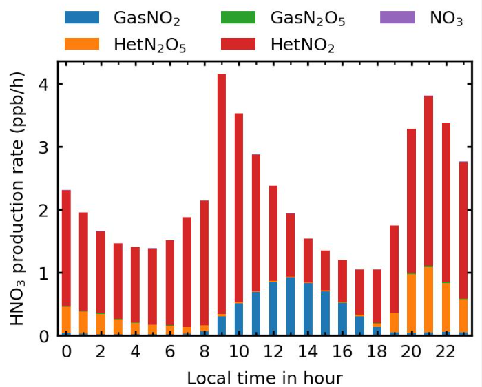

## 代码结构分析

### drive.F 主程序

1. 一些数组说明：
   1. CGRID,指针，指向PCGRID，所有物种瞬时浓度的存储数组
   2. AGRID平均浓度的数组，输出时在wr_aconc.F文件中判断是否是输出物种和输出层数
   3. SGRID输出到CONC文件的瞬时物种浓度的数组，即CGRID的子集
2. 依次运行的模块
   1. GRID_INIT()：网格定义
   2. CGRID_SPCS_INIT()：物种定义
   3. PAGRD_INIT()：PA模块网格定义
   4. PCGRID_INIT()：定义物种PCGRID数组 
   5. CONC_DEFN() | A_CONC_DEFN()：获取输出的CONC、ACONC文件对应的物种名称
   6. WVEL_INIT()：读取环境变量“CTM_WVEL” ，是否输出沉降速度
   7. INITSCEN()：输出IC到CONC文件
   8. PA_INIT()：PA模块初始化，创建输出文件并初始化数组
   9. FLCHECK()：文件header信息检查
   10. 分配相关数组的内存：AGRID、RCONC、CFLAG、ASTEP
   11. ADVSTEP()：计算时步
   12. SCIPROC()：理化过程计算程序
3. 调用的子程序
   1. GRID_CONF.F  网格设置，会调用HGRD_DEFN.F和VGRD_DEFN.F， 其中，HGRD读取"GRIDDESC"文件，VGRD读取MET_CRO_3D文件中的垂直信息
   2. CGRID_SPCS.F 物种设置，读取GC_nml，AE_nml等物种定义文件
   3. PAGRD_DEFN.F 读取环境变量中的一些设置，PA模块有关
   4. PCGRID_DEFN.F 定义物种数组，PCGRID, 这是CGRID指针的目标，即CGRID指向PCGRID
   5. STD_CONC.F、AVG_CONC.F  定义物种名称CONC_SPCS、AVG_SPCS
   6. initscen.F 输出IC到CONC文件
   7. pa_init.F、flcheck.F
   8. advstep.F 根据CFD条件（Courant-number conditions）计算时步，TSTEP(2)指运行的时间步长，TSTEP(1)指输出的时间步长（run脚本设置，在initscen.F读取），NREPS指输出时间步长中的时步数量，NREPS=TSTEP(1)/TSTEP(2)
   9. sciproc.F 理化过程

### SCIPROC程序说明

#### CHEM: grdriver.F

1. 第一次运行需要smvgear初始化 GRVARS_INIT、GRINIT、JSPARSE
2. 排放：默认不需要
3. **定义MET_CRO_3D文件的网格的起始位置 （注意boxmodel待修改） SUBHFILE(MET_CRO_3D)**
4. FIND_DEGRADED：确定degradation（降解）的物种
5. **从气象文件中读取TA, QV, DENS, PRES**
6. **PHOT.F 计算光解速率-这里会读取气象数据**, 主要流程：
   1. 初次运行：
      1. SUBHFILE: GRID_CRO_2D，MET_CRO_2D，MET_CRO_3D
      2. LOAD_REF_DATA()：读取CSQY_DATA文件中的数据
      3. 从GRID_CRO_2D读取纬度 LAT
      4. 判断landuse类型，计算FRACTION_LANDUSE；判断是否有SEAICE变量；定义一些数组
      5. 读取经度LON, 计算CONLAT, SINLAT
      6. 读取地面高度HT
      7. O3和NO2指针
   2. 读取一些变量：SNOCOV (snow cover)
   3. 太阳相关参数计算，输入经纬度、年份和天，SOLEFM3
   4. 计算太阳高度角：GETZEN2
   5. 判断是否是夜晚 DARK
   6. 读取变量：ZH、ZF、DENS、TA、PRES、WBAR、CLDT、CLDB、CFRAC
   7. AERO_PHOTDATA：计算气溶胶特性
   8. NEW_OPTICS：计算晴空光解速率
   9. NEW_OPTICS：计算有云情况下光解速率
7. 进入block循环：
   1. PA_IRR_CKBLK、PA_IRR_BLKSTRT
   2. CALCKS：计算反应速率
   3. INIT_DEGRADE
   4. SMVGEAR：化学模块积分
   5. FINAL_DEGRADE

#### AERO: aero_driver.F

1. 第一次运行，初始化：
   1. **打开气象文件**
   2. 打开能见度文件 OPVIS: opvis.F
   3. 打开气溶胶参数(粒径和标准差)文件OPDIAM: opdiam.F
   4. **定义MET_CRO_3D文件的网格的起始位置 （注意boxmodel待修改） SUBHFILE(MET_CRO_3D)**
   
2. **读取气象：PRES、TA、QV、DENS、GSW**

3. 进入格点循环：
   1. 从CGRID数组中提取相关数据：EXTRACT_AERO、EXTRACT_PRECURSOR、EXTRACT_SOA
   2. **计算气溶胶过程 AEROPROC： aero_subs.F**
      1. GETPAR: getpar.f 计算M3, mass, 气溶胶密度，直径
      2. ORGAER： SOA传统生成路径， SOA_DEFN.F
      3. POAAGE：POA氧化，poaage.F
      4. HETCHEM：非均相反应（N2O5, sulfate, GLY, MGLY），hetchem.f
      5. GETPAR
      6. VOLINORG：NPF和SNA+Cl的气粒转化
      7. coagulation：GETCOAGS
      8. GETPAR
   3. 更新CGRID数组：UPDATE_AERO、UPDATE_PRECURSOR、UPDATE_SOA
   4. 计算每个模态中PM2.5的占比：INLET25： aero_subs.F
   5. 输出：
      1. 计算能见度相关 GETVISBY：aero_subs.F
      2. 计算不同模态 M2 and M3值
      3. 粒径分布 计算直径和标准差 GETPAR
   
4. 气溶胶排放处理：

   1. ```fortran
      EMIS_DEFN.F 排放处理主程序，会调用AERO_EMIS_INIT 和 GET_AERO_EMIS
      
      AERO_EMIS.F
      
      AERO_EMIS_INIT
      GET_AERO_EMIS
      
      ```

## 非均相机制修改说明

1. smvgear chem solver 修改文件:

   ```fortran
   ! part 1. 准备mech.def文件，增加
   ! iorganic heteorogeneous reactions from hetchem version 5.0.2
   <HET_N2O5> N2O5 = 2.0*HNO3 # 1.0~<HETERO_N2O5IJ>;
   <HET_N02I> NO2 = ANO3I # 1.0~<HETERO_NO2I>;
   <HET_NO2J> NO2 = ANO3J # 1.0~<HETERO_NO2J>;
   <HET_SO2I> SO2 = ASO4I  # 1.0~<HETERO_SO2I>;
   <HET_SO2J> SO2 = ASO4J  # 1.0~<HETERO_SO2J>;
   <HET_HO2> HO2 =  # 1.0~<HETERO_HO2>;
   
   ! part 2. 运行chemech工具，生成RXNS_DATA_MODULE.F90和RXNS_FUNC_MODULE.F90
   ! 将这两个文件替换成新的
   
   ! part 3. 修改下面两个文件
   AEROSOL_CHEMISTRY.F ! 主要涉及非均相反应速率
   grdriver.F ! 增加DORN变量,判别白天夜间
   
   ```

   

## box model 修改

### 代码上的改动

1. 增加rdconc.F 文件，读取observation数据； 并在FILES_CTM.EXT中增加GAS_DATA定义
2. 修改driver.F文件，将读取的obs赋值到CGRID数组
3. 修改sciproc.F文件，开关相应的过程
4. 修改EMIS_DEFN.F文件，注释和MGEMIS有关的项，同时修改ASX_DATA_MOD.F，注释OCEAN_1相关，这样不需要准备ocean文件了
5. 修改Makefile，增加rdconc
6. 修改initscen.F，注释CALL OPWDEP，不生成WETDEP文件

### 输入文件

```bash
ICON_eastasia36_EASTASIA36_profile

GRIDDESC
GRIDCRO2D_2022-07-02
METCRO2D_2022-07-02
METCRO3D_2022-07-02

metdot3d
# metdot3d 变量有
    # UWIND
    # VWIND
    # UHAT_JD、VHAT_JD 和adv有关
    # UWINDC
    # VWINDC

OMI_1979_to_2017.dat
s07ae6_conc_36km.2022183_1min.ncf

```

### ekman曲线

- 运行VOC+NOx两组实验，每组（0, 0.2, 0.4, 0.6, 0.8, 1, 1.2）,共49组实验
- 存在问题：
  - **观测数据缺少NO**：增加FixNOratio 选项，根据模拟的NO/NO2比例，基于NO2的观测设置NO的浓度
  - **观测数据缺少$NH_3$**:  模式中NH3消耗很快，基本都是0，因此增加输入NH3排放
  - **模拟的臭氧浓度很高**：考虑沉降过程，sciproc中打开vdiff，需要METDOT3D文件

### RIR分析

- 运行VOC物种

### MCM版本

- MCM版本用于RIR分析
- 由于PA没有编译，不能分析硝酸盐的生成途径

### S07版本

- 要模拟硝酸盐，NH3需要作为输入

- PA 说明

  - pa.inp

  ```fortran
  ! what(1) key, module and SID; SCCS file; date and time of last delta:
  ! @(#)pa.inp	2.1 /project/mod3/ICL/src/procan/pa/SCCS/s.pa.inp 12 Dec 1996 14:10:18
  
  IRRTYPE = 
  
  PARTIAL;
  
  IRR_OUTPUT HNO3prod = PROD[HNO3];
  !DESCRIPTION = 'PROD change in HNO3';
  
  IRR_OUTPUT HNO3fromNO2_OH = <25>;
  IRR_OUTPUT HNO3fromN2O5_Gas = 2*<13>;
  IRR_OUTPUT HNO3fromNO3_HO2 = 0.2*<39>;
  IRR_OUTPUT HNO3fromNO3_Org = <BP07>+<BP10>+<BP13>+<BP33>+<BP36>
                               +<BP39>+<BP45>+0.15*<BP66>+<BP74>
                               +0.967*<BP77>+0.5*<BP56>+0.6*<IS31>;
                               
  IRR_OUTPUT HNO3fromNO2_Het = 0.5*<HET_N02>;
  IRR_OUTPUT HNO3fromN2O5_Het = 2.0*<HET_N2O5>;
  
  IRR_OUTPUT HNO3fromHET_N2O5 = <HET_N2O5IJ>+<HET_N2O5K>
                               +<HET_H2NO3PIJA>+<HET_H2NO3PKA>;
  IRR_OUTPUT HNO3fromHET_NO55 = <HET_N2O5IJ>+<HET_N2O5K>;
  IRR_OUTPUT HNO3fromHET_NO3 = <HET_NO3>;
  IRR_OUTPUT HNO3fromOrganic = <HYD_MT>+2*<HYD_ISOP>;
  
  ENDPA;
  ```

  - 对应的mech 方程

  ```fortran
  !!! 气相反应
  <13> N2O5 + H2O = 2*HNO3 # 1.00e-22;
  <25> OH + NO2 = HNO3 # 3.2e-30^-4.50&3.0e-11&0.41&1.24;
  <39> NO3 + HO2 = 0.8*OH + 0.8*NO2 + 0.2*HNO3 # 4.00e-12;
  
  !!! 非均相反应
  <HET_N2O5> N2O5 = 2.0*HNO3 # 1.0~<HETERO_N2O5IJ>;
  ! 注意是0不是O,估计在mech中写错了！！！
  <HET_N02I> NO2 = ANO3I # 1.0~<HETERO_NO2I>;
  <HET_NO2J> NO2 = ANO3J # 1.0~<HETERO_NO2J>;
  <HET_N2O5IJ>    N2O5 = HNO3 + H2NO3PIJ  # 1.0~<HETERO_N2O5IJ>;
  <HET_N2O5K>     N2O5 = HNO3 + H2NO3PK   # 1.0~<HETERO_N2O5K>;
  <HET_H2NO3PIJA> H2NO3PIJ = HNO3         # 1.0~<HETERO_H2NO3PAIJ>;
  <HET_H2NO3PKA>  H2NO3PK  = HNO3         # 1.0~<HETERO_H2NO3PAK>;
  
  !!! 有机部分
  <BP07> HCHO + NO3 = HNO3 + HO2 + CO # 2.00e-12@2431;
  <BP10> CCHO + NO3 = HNO3 + MECO3 # 1.40e-12@1860;
  <BP13> RCHO + NO3 = HNO3 + RCO3 # 1.40e-12@1601;
  <BP33> GLY + NO3 = HNO3 + 0.70*HO2 + 1.40*CO + 0.3*HCOCO3
          # 2.80e-12@2390;
  <BP36> MGLY + NO3 = HNO3 + CO + MECO3 # 1.40e-12@1895;
  <BP39> CRES + NO3 = HNO3 + BZO + XC # 1.40e-11;
  <BP45> BALD + NO3 = HNO3 + BZCO3 # 1.34e-12@1860;
  <BP66> IPRD + NO3 = 0.15*MACO3 + 0.15*HNO3 + 0.799*RO2C + 0.799*xHO2 +
           0.051*RO2XC + 0.051*zRNO3 + 0.572*xCO + 0.227*xHCHO + 0.218*xRCHO +
           0.008*xMGLY + 0.572*xRNO3 + 0.85*yR6OOH + 0.278*XN - 0.815*XC
          # 1.00e-13;
  <BP74> HOCCHO + NO3 = HNO3 + MECO3 # 1.0*K<BP10>;
  <BP77> ACROLEIN + NO3 = 0.031*xHO2 + 0.967*MACO3 + 0.031*RO2C + 0.002*RO2XC +
           0.002*zRNO3 + 0.967*HNO3 + 0.031*xCO + 0.031*xRNO3 + 0.033*yROOH +
           0.002*XN - 1.097*XC # 1.18e-15;
  <BP56> MACR + NO3 = 0.5*IMACO3 + 0.5*RO2C + 0.5*HNO3 + 0.5*xHO2 + 0.5*xCO +
           0.5*yROOH + 1.5*XC + 0.5*XN # 1.50e-12@1815;
  <IS31>  NIT1 + NO3 = 0.6*NIT1NO3OOA + 0.6*HNO3 + 0.4*NIT1NO3OOB # 3.15e-13@448;
  
  !!!
  <HET_NO3>     NO3 = HNO3                 # 1.0~<HETERO_NO3>;
  
  !!! 颗粒态硝酸盐水解
  ! Hydrolysis of particle-phase nitrates
  <HYD_MT>   AMTNO3J  = HNO3 + 1.00*AMTHYDJ #9.259E-5;
  <HYD_ISOP> AISOPNNJ = 2.0*HNO3 + 0.5*AMTHYDJ #9.259E-5;
  
  ```

  

- 问题：使用revised非均相机制NO2非均相的贡献很大
- 
- 