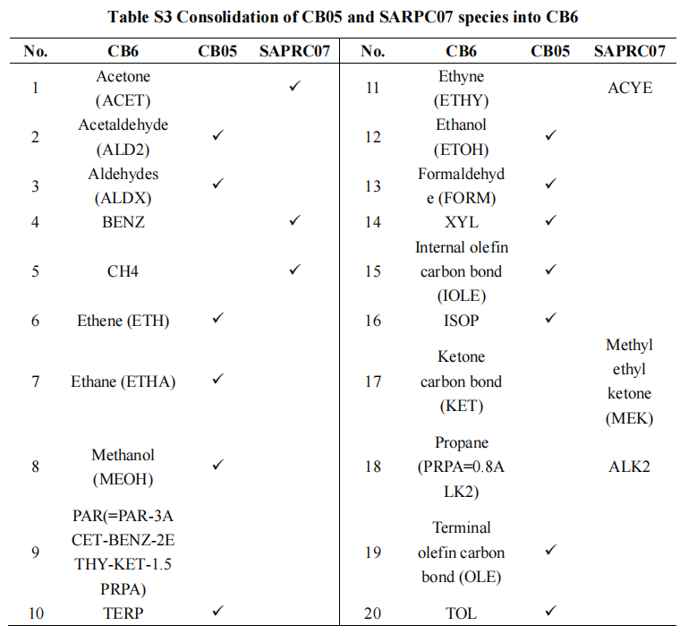

## CB机制排放处理

- 问题1： MEIC只提供CB05排放，CB6机制中需要额外的物种排放（ACET, BENZ, KET, ETHY, PRPA)
- 解决方案：使用SAPRC07机制中的替代（参考Huang et al., 2023, STE）
- 
- 问题2：CB05 和CB6中都需要XYLMN, SOAALK, and NAPH排放，If you have an emission files without XYLMN, SOAALK, and NAPH, you can estimate these as follows: These estimates are approximate and are based on the 2011 NEIv1. Use at your own discretion:

```fortran
NAPH (moles) = 0.002 * XYL (moles)
XYLMN (moles) = 0.998 * XYL (moles)
PAR(new)(moles) = PAR (moles) -0.00001*NAPH(moles)
SOAALK (moles) = 0.108*PAR (moles)
```

- PAR(=PAR-3ACET-BENZ-2ETHY-KET-1.5PRPA)