## 不同版本SOA机制

### 物种对比

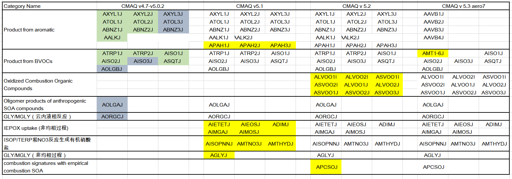

### CMAQ v4.7

- 参考Carlton et al., 2010, EST. **Model Representation of Secondary Organic Aerosol in CMAQv4.7**

- In CMAQv4.7, SOA is produced from an expanded list of precursors (Table 1) and can be formed via both gas- and

  aqueous-phase oxidation processes, as well as aerosol-phase reactions. Seven of the 19 secondary organic PM species are

  treated as nonvolatile (dark-shaded rectangles in Figure 1). The 12 remaining species are semivolatile and have ∆Hvap

  values reduced in accordance with recent experimental data.

  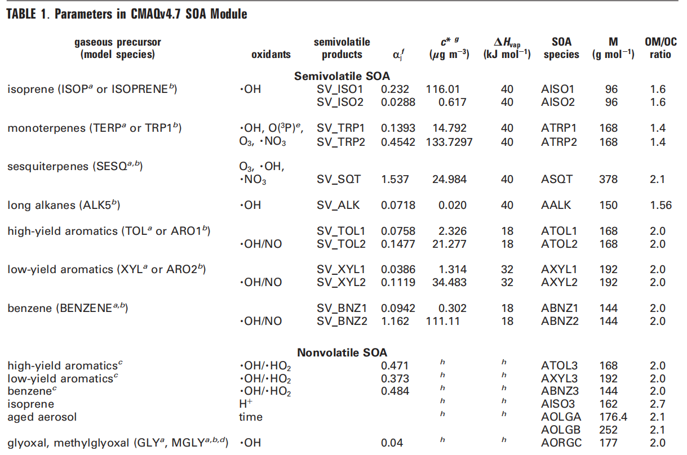

  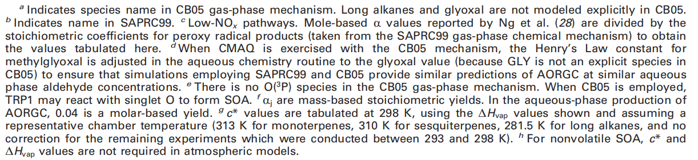

  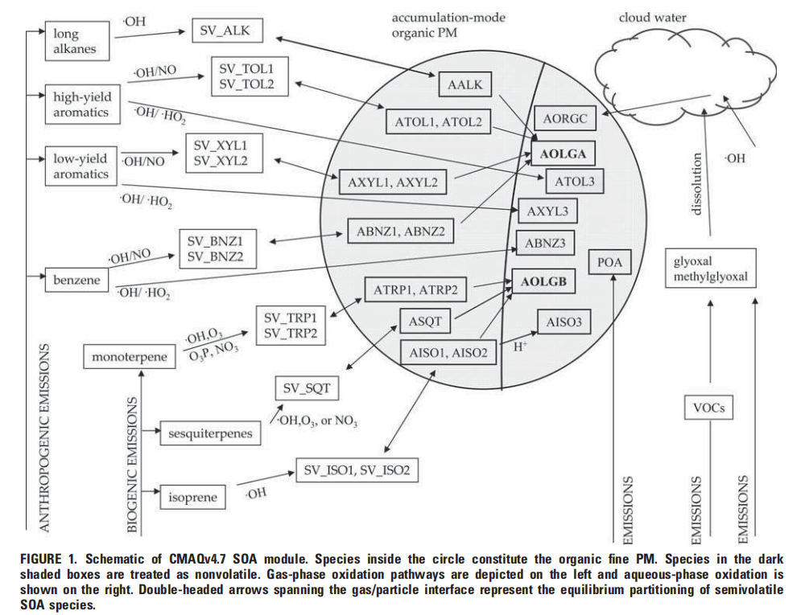

  - 半挥发的部分会发生凝聚相低聚反应生成AOLGA 和AOLGB,  GLY和MGLY是云中的液相反应

### CMAQ v5.1

- 参考Appel et al., 2017, GMD **Description and evaluation of the Community Multiscale Air Quality (CMAQ) modeling system version 5.1**
- 在CMAQ v5.0.2 （和4.7改变不大）基础上修改
- 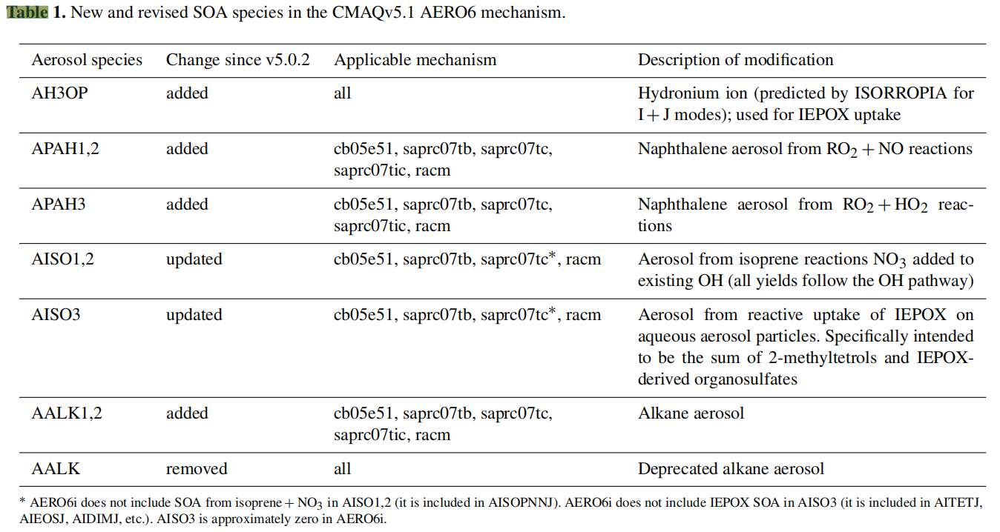
- 更新了isoprene生成SOA的过程（Pye et al., 2013, EST)：isoprene和OH的反应产物ISOPO2在低/高NOx条件下分别和HO2和NO反应生成IEPOX和MAE（以及HMML），随后IEPOX、MAE和HMML通过非均相反应生成：AIETETJ   AIEOSJ   ADIMJ     AIMGAJ    AIMOSJ    
- 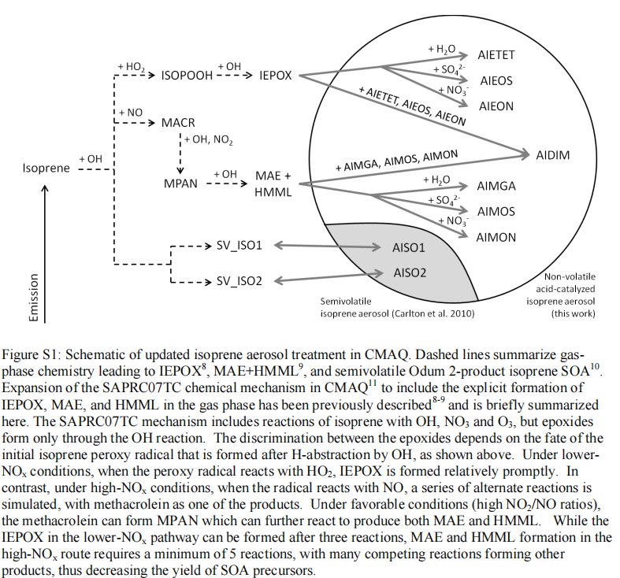
- 更新有机硝酸盐部分（Pye et al., 2015, EST）：
  - isoprene和NO3反应生成ISOPNN，进一步生成半挥发性硝酸盐： AISOPNNJ 
  - terprene和NO3反应生成MTNO3，进一步生成半挥发性硝酸盐：AMTNO3J  
  - AISOPNNJ和AMTNO3J  会非均相水解生成AMTHYDJ
- 增加GLY和MGLY非均相过程，生成AGLYJ
- 5.1版本SOA生成概念图（Pye et al., 2017, ACP）
- 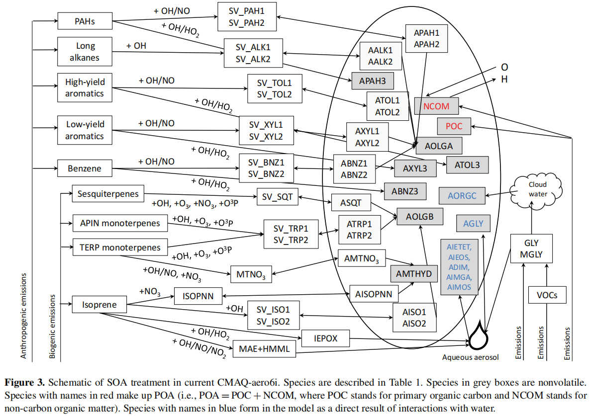
- 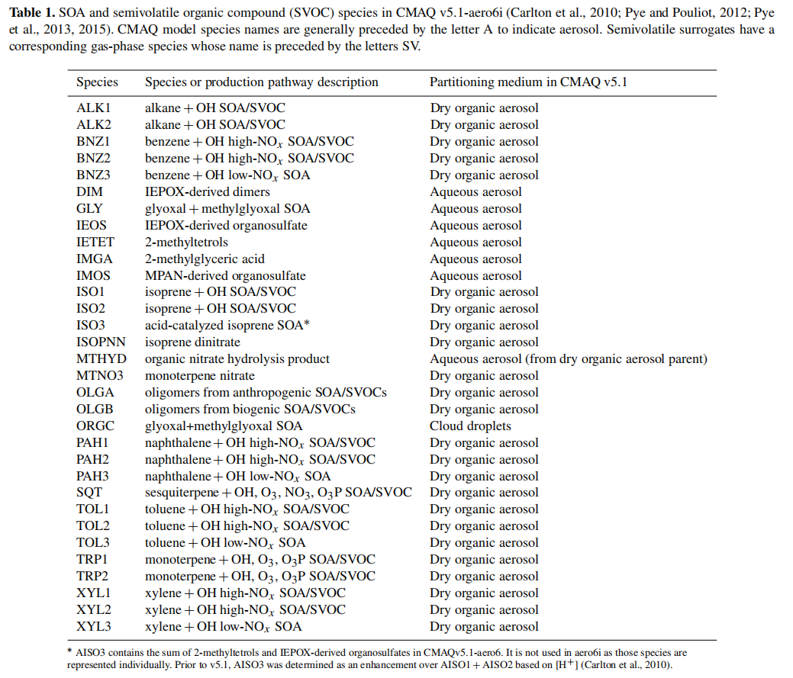
- 

### CMAQ v5.2

- 参考 [CMAQ/CCTM/docs/Release_Notes/README.md at 5.2 · USEPA/CMAQ · GitHub](https://github.com/USEPA/CMAQ/blob/5.2/CCTM/docs/Release_Notes/README.md)

- 主要参考文献（Murphy et al., 2017, ACP）（Pye et al., 2017, ACP）

- 更新POA部分，5.1中POA分为POC+NCOM, 5.2中考虑了不同的挥发性的差异（Murphy et al., 2017, ACP）

  - POA多级氧化

      - POA划分为不同的挥发性,存在gas和aerosol两种相态：低挥发性V/ALVPO1, 半挥发性V/ASVPO(1,2,3),中等挥发性V/AIVPO(1); 

      - 部分gas phase POA本身通过气粒分配生成aerosol phase POA（ALVPO1J等）

      - 气相机制中POA(g)老化生成对应的氧化产物VLVPO1 等，最后气粒分配生成SOA（ALVOO1J等）

      - ```fortran
        ! part 1. emissions in GC.nml
        'VLVPO1:218:POC:1.0:VD_ORA:1:::ADIPIC_ACID:1:VLVPO1::Yes:Yes:Yes:Yes',
        'VSVPO1:230:POC:1.0:VD_ORA:1:::ADIPIC_ACID:1:VSVPO1::Yes:Yes:Yes:Yes',
        'VSVPO2:241:POC:1.0:VD_ORA:1:::ADIPIC_ACID:1:VSVPO2::Yes:Yes:Yes:Yes',
        'VSVPO3:253:POC:1.0:VD_ORA:1:::ADIPIC_ACID:1:VSVPO3::Yes:Yes:Yes:Yes',
        'VIVPO1:266:POC:1.0:VD_ORA:1:::ADIPIC_ACID:1:VIVPO1::Yes:Yes:Yes:Yes',
        'VLVOO1:136:::VD_ORA:1:::ADIPIC_ACID:1:VLVOO1::Yes:Yes:Yes:Yes',
        'VLVOO2:136:::VD_ORA:1:::ADIPIC_ACID:1:VLVOO2::Yes:Yes:Yes:Yes',
        'VSVOO1:135:::VD_ORA:1:::ADIPIC_ACID:1:VSVOO1::Yes:Yes:Yes:Yes',
        'VSVOO2:135:::VD_ORA:1:::ADIPIC_ACID:1:VSVOO2::Yes:Yes:Yes:Yes',
        'VSVOO3:134:::VD_ORA:1:::ADIPIC_ACID:1:VSVOO3::Yes:Yes:Yes:Yes',
        
        ! part 2. reaction with OH to produce PCSOARXN in mech.def
        ! Aging with Func. and Frag. (Donahue et al. 2012)
        <POA_AGE1> VLVPO1 + OH = OH
              + 0.4857 * VLVPO1 + 0.0062 * VSVPO1
              + 0.0025 * VSVPO2 + 0.0026 * VSVPO3
              + 0.0023 * VIVPO1 + 0.2944 * VLVOO1
              + 0.2021 * VLVOO2 + 0.0019 * VSVOO2
              + 0.0023 * VSVOO3                   #4.0e-11;
        <POA_AGE2> VSVPO1 + OH = OH
              + 0.3003 * VLVPO1 + 0.2862 * VSVPO1
              + 0.0041 * VSVPO2 + 0.0035 * VSVPO3
              + 0.2239 * VLVOO1 + 0.1820 * VLVOO2 #4.0e-11;
        <POA_AGE3> VSVPO2 + OH = OH
              + 0.3856 * VLVPO1 + 0.0950 * VSVPO1
              + 0.1373 * VSVPO2 + 0.0005 * VSVPO3
              + 0.2051 * VLVOO1 + 0.1764 * VLVOO2 #4.0e-11;
        <POA_AGE4> VSVPO3 + OH = OH
              + 0.2181 * VLVPO1 + 0.3063 * VSVPO1
              + 0.0153 * VSVPO2 + 0.1043 * VSVPO3
              + 0.1893 * VLVOO1 + 0.1668 * VLVOO2 #4.0e-11;
        <POA_AGE5> VIVPO1 + OH = OH
              + 0.2412 * VLVPO1 + 0.2089 * VSVPO1
              + 0.3000 * VSVPO2 + 0.2028 * VLVOO1
              + 0.0471 * VLVOO2                   #4.0e-11;
        <POA_AGE6> VLVOO1 + OH = OH
              + 0.6664 * VLVOO1 + 0.0143 * VLVOO2
              + 0.0123 * VSVOO1 + 0.1239 * VSVOO2
              + 0.1831 * VSVOO3                   #4.0e-11;
        <POA_AGE7> VLVOO2 + OH = OH
              + 0.2858 * VLVOO1 + 0.3931 * VLVOO2
              + 0.0139 * VSVOO1 + 0.1027 * VSVOO2
              + 0.2045 * VSVOO3                   #4.0e-11;
        <POA_AGE8> VSVOO1 + OH = OH
              + 0.3303 * VLVOO1 + 0.2272 * VLVOO2
              + 0.2607 * VSVOO1 + 0.0702 * VSVOO2
              + 0.1116 * VSVOO3                   #4.0e-11;
        <POA_AGE9> VSVOO2 + OH = OH
              + 0.3444 * VLVOO1 + 0.2749 * VLVOO2
              + 0.0491 * VSVOO1 + 0.2577 * VSVOO2
              + 0.0739 * VSVOO3                   #4.0e-11;
        <POA_AGE10> VSVOO3 + OH = OH
              + 0.3886 * VLVOO1 + 0.2421 * VLVOO2
              + 0.0640 * VSVOO1 + 0.0385 * VSVOO2
              + 0.2667 * VSVOO3                   #4.0e-11;
        
        ! part 3. SOA production in SOA_DEFN.F
             & vapor_type('VLVPO1  ',  0.0000,    1.e-1,  96.0E3, 'ALVPO1J', 'A',  0.0, '        '),
             & vapor_type('VSVPO1  ',  0.0000,    1.e+0,  85.0E3, 'ASVPO1J', 'A',  0.0, '        '),
             & vapor_type('VSVPO2  ',  0.0000,    1.e+1,  74.0E3, 'ASVPO2J', 'A',  0.0, '        '),
             & vapor_type('VSVPO3  ',  0.0000,    1.e+2,  63.0E3, 'ASVPO3J', 'A',  0.0, '        '),
             & vapor_type('VIVPO1  ',  0.0000,    1.e+3,  52.0E3, 'AIVPO1J', 'A',  0.0, '        '),
             & vapor_type('VLVOO1  ',  0.0000,    1.e-2, 107.0E3, 'ALVOO1J', 'A',  0.0, '        '),
             & vapor_type('VLVOO2  ',  0.0000,    1.e-1,  96.0E3, 'ALVOO2J', 'A',  0.0, '        '),
             & vapor_type('VSVOO1  ',  0.0000,    1.e+0,  85.0E3, 'ASVOO1J', 'A',  0.0, '        '),
             & vapor_type('VSVOO2  ',  0.0000,    1.e+1,  74.0E3, 'ASVOO2J', 'A',  0.0, '        '),
             & vapor_type('VSVOO3  ',  0.0000,    1.e+2,  63.0E3, 'ASVOO3J', 'A',  0.0, '        ')/)
        
        ```

  - Potential Combustion SOA：APCSOJ（这部分的加入是为了补偿IVOC氧化，wall loss, VOC产物多级氧化等过程的缺失）

      - ```fortran
        ! part 1. emissions in GC.nml
        'PCVOC:170:POC:0.0387:VD_GEN_ALD:1.0:::GENERIC_ALDEHYDE:1.0:::Yes:Yes:Yes:Yes',

        ! part 2. reaction with OH to produce PCSOARXN in mech.def
        ! Formation of Potential Combustion SOA (pcSOA)
        <PCSOA>  PCVOC + OH       = OH  + PCSOARXN  # 1.25E-11;

        ! part 3. SOA production in SOA_DEFN.F
             & vapor_type('LV_PCSOG',  1.0   ,   1.0e-5,  40.0E3, 'APCSOJ ', 'A', 10.0, 'PCSOARXN'),
        ```

- 更新Glyoxal and methylglyoxal SOA updates （Pye et al., 2017, ACP）

  - 在5.1版本上修改 uptake coefficient of MGLY

- 更新SOA的一些属性：Several properties of semivolatile SOA species (aerosol and nonreactives) were updated: number of carbon atoms per molecule, density, organic-mass-to-organic-carbon (OM/OC) ratio (now in species definition file), and molecular weights. In addition, unique dry and wet deposition surrogates were implemented for each semivolatile species. See Pye et al. (2017) for how updated properties were determined

- 

### CMAQ v5.3

- 参考Appel et al., 2021, GMD; Xu et al., 2018, ACP; Qin et al., 2021, NS
- 增加aero7气溶胶方案，注意编译的时候选择
- aero7中更新 organic nitrates from monoterpenes机制，原有的ATRP(1,2)替换为AMT(1-7),模式中实际只有AMT1-6,SVMT7 is ignored assuming it does not condense appreciably to the particle phase.
- 注意排放处理的时候需要单独出$\alpha-pinene$ ； Use the emission control file and assign 30% of emitted TERP to APIN and 70% of emitted TERP to TERP.
- 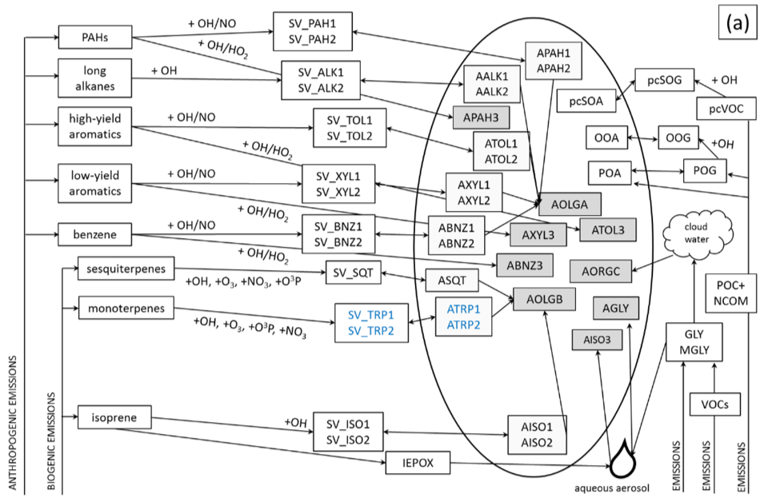
- 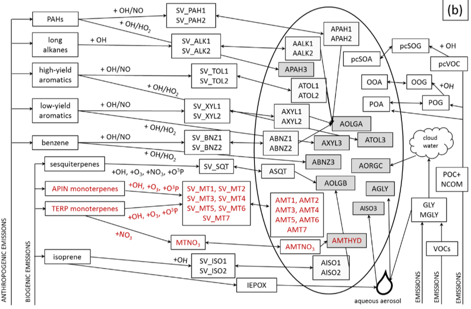
- a图是aero6中的SOA，b图是Xu et al., 2018, ACP更新部分（AMT1-7），红色表示新增，蓝色表示删除的部分
- 基于VBS框架的SOA生成，AAVB1J, AAVB2J, AAVB3J, AAVB4J替换aero6中的人为源部分ABNZ1J, ABNZ2J, ABNZ3J, SV_BNZ1, SV_BNZ2, AXYL1J, AXYL2J, AXYL3J, SV_XYL1, SV_XYL2, ATOL1J, ATOL2J, ATOL3J, SV_TOL1, SV_TOL2, APAH1J, APAH2J, APAH3J, SV_PAH1, SV_PAH2, AALK1J, AALK2J, SV_ALK1, SV_ALK2,详见Qin et al., 2021. **Supplementary Table 5.** 
- 在mech.def文件中，原有的BNZNRXN等替换为对应的SVAVB1-4，详见Qin et al., 2021. **Supplementary Table 4.** 
- 物种生成路径（源解析标记物种说明）：
  1.  AAVB1J， AAVB2J， AAVB3J， AAVB4J

### 组内版本

- 默认黑色箭头，半挥发性 SV-SOA
  - ALK5， BNZ， ARO，XYL，ISO，TERP，SESQT
  - 烷烃，苯，芳香烃，二甲苯，异戊二烯，单萜烯 ，倍半萜烯
- 红色： 非挥发性 NV-SOA
  - 乙二醛（GLY），甲基乙二醛（MGLY），异戊二烯环氧化物（IEPOX）和甲基丙烯酸环氧化物（MAE）

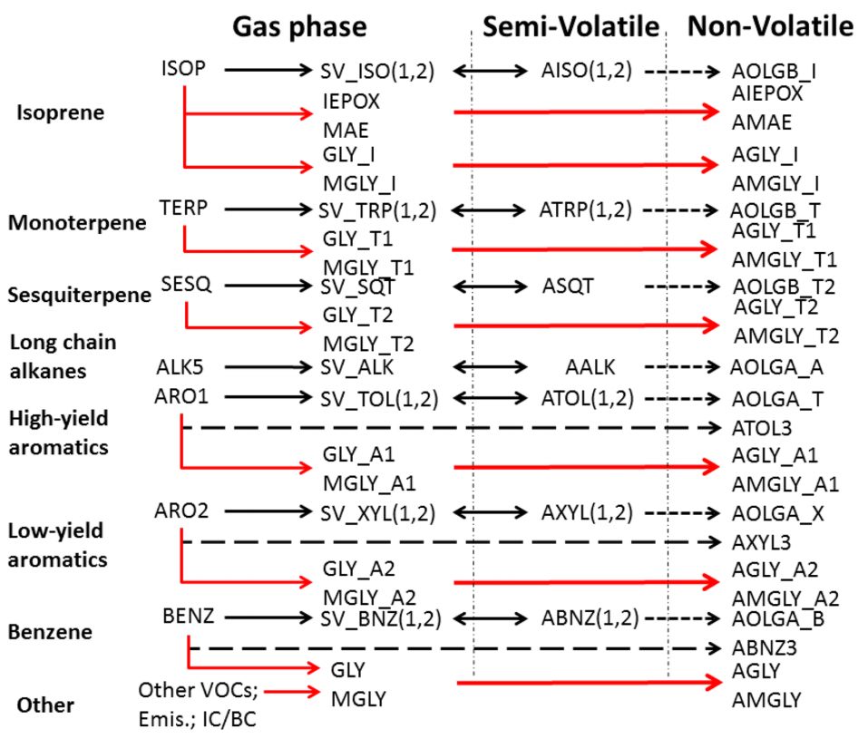

- 对SOA的相对贡献
  - 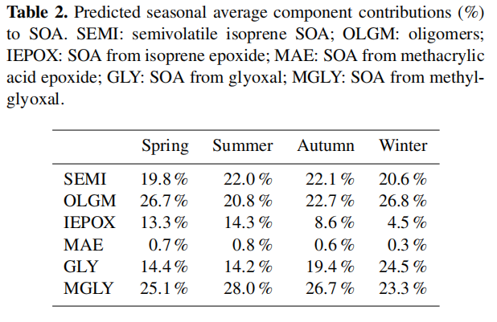
  - 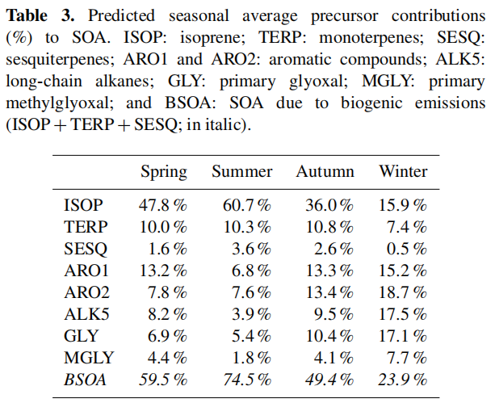
  - 
- SV-SOA and NV-SOA
  - 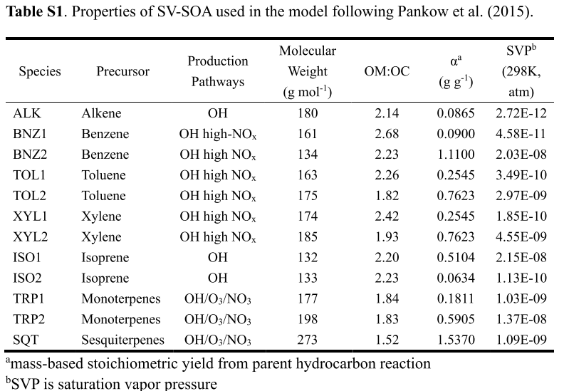
  - 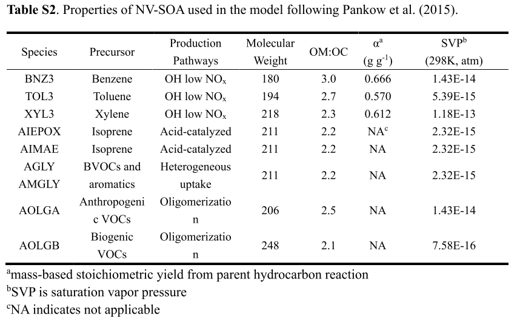