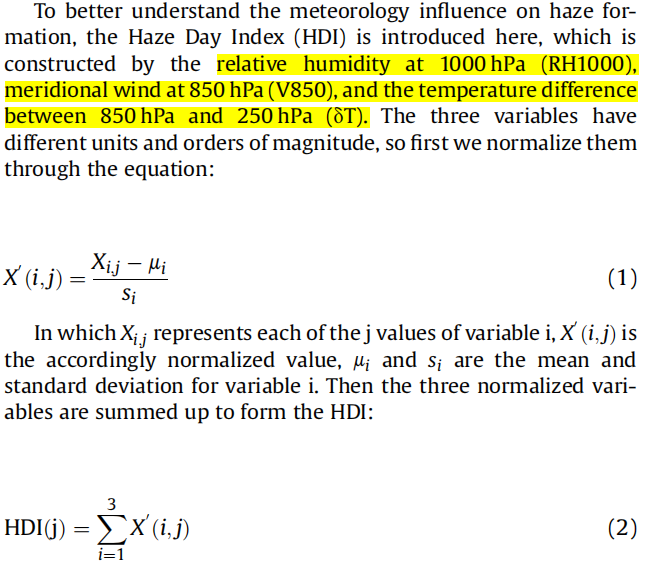
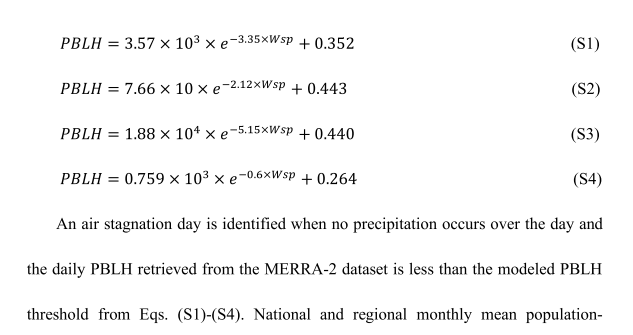

# Cai et al., 2017, NCC

- 10.1038/nclimate3249

- **Haze weather index (HWI)** 

- Because V850,  $\Delta{T}$ and U500 are not independent, we normalized each time series by its respective standard deviation

  and summed the three normalized time series to construct a single index.

  

# Zhang et el., 2018, EP

- https://doi.org/10.1016/j.envpol.2018.08.019
- Haze Day Index (HDI)

# Horton et al., 2014, NCC

- **DOI: 10.1038/NCLIMATE2272**
-  Air Stagnation Index (ASI)
- A grid cell day is considered stagnant when daily-mean near-surface (10-m) wind speeds are *<*3.2 m s−1 , daily-mean mid-tropospheric (500 mb) wind speeds are *<*13 m s−1 , and daily-mean precipitation accumulation is *<*1 mm.

# Wang et al., 2018, BMAS

- doi:10.1175/BAMS-D-16-0301.1
- air stagnation day

