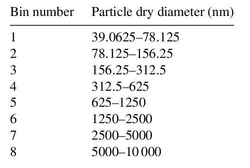
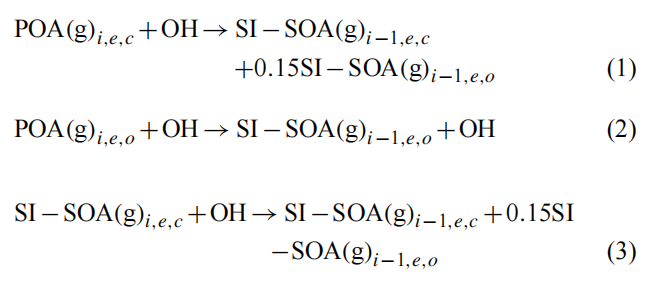
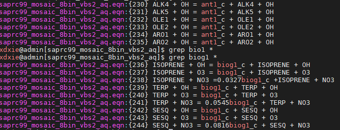
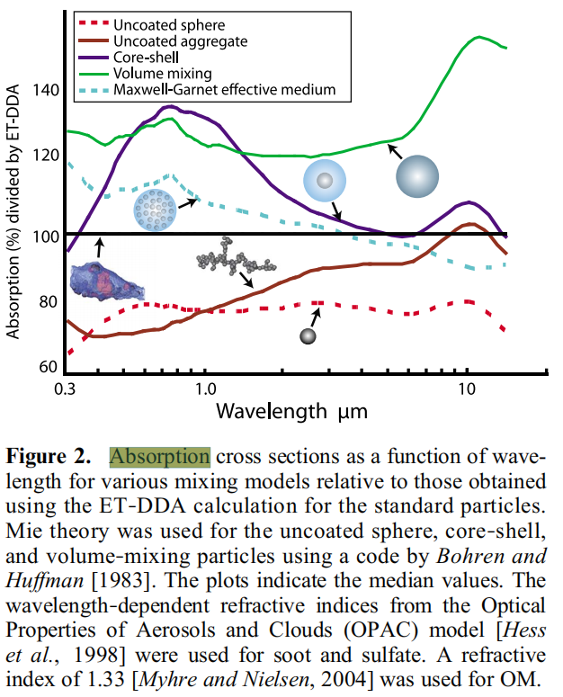

# 安装

- 问题1：configure之后需要修改下configure.wrf文件，mpif90改成mpiifort
- 

# 运行

## 排放处理

- 关于wildfire排放

  - 在```Registry/registry.chem```中，有物种定义
  - ```package   biomassb      biomass_burn_opt==1             -          state:mean_fct_agtf,mean_fct_agef,mean_fct_agsv,mean_fct_aggr,firesize_agtf,firesize_agef,firesize_agsv,firesize_aggr;ebu:ebu_no,ebu_no2,ebu_co,ebu_co2,ebu_eth,ebu_hc3,ebu_hc5,ebu_hc8,ebu_ete,ebu_olt,ebu_oli,ebu_pm25,ebu_pm10,ebu_dien,ebu_iso,ebu_api,ebu_lim,ebu_tol,ebu_csl,ebu_hcho,ebu_ald,ebu_ket,ebu_macr,ebu_ora1,ebu_ora2,ebu_so2,ebu_nh3,ebu_oc,ebu_bc,ebu_sulf,ebu_dms;ebu_in:ebu_in_no,ebu_in_no2,ebu_in_co,ebu_in_co2,ebu_in_eth,ebu_in_hc3,ebu_in_hc5,ebu_in_hc8,ebu_in_ete,ebu_in_olt,ebu_in_oli,ebu_in_pm25,ebu_in_pm10,ebu_in_dien,ebu_in_iso,ebu_in_api,ebu_in_lim,ebu_in_tol,ebu_in_csl,ebu_in_hcho,ebu_in_ald,ebu_in_xyl,ebu_in_ket,ebu_in_macr,ebu_in_ora1,ebu_in_ora2,ebu_in_so2,ebu_in_nh3,ebu_in_oc,ebu_in_bc,ebu_in_sulf,ebu_in_dms,ebu_in_ash```
  - ```ebu```表示最终模式需要的物种；```ebu_in``` 表示排放文件中的物种（```wrffirechemi_d01```文件中，物种名称为```ebu_in_no```）

- 数据处理流程

  1. 数据读取程序为``` share/mediation_integrate.F ```, 数据读到```ebu_in```数组中（此为推测），如下：

  - ```fortran
    	CALL med_auxinput_in ( grid, ialarm, config_flags )
        WRITE ( message , FMT='(A,i3,A,i3)') 'Input data processed for aux input ',&
        	ialarm - first_auxinput + 1, ' for domain ',grid%id
    ```

  2. 在```chem/emissions_driver.F```程序中调用 ```do_plumerisefire```将```ebu_in```赋值给```ebu```, 

     - 涉及子程序```chem/module_plumerise1.f90```
     - ```do_plumerisefire```是根据```namelist.input```中的```plumerisefire_frq```来设置的，每隔一段时间运行一次

     - ```fortran
              if( do_plumerisefire )then
                 CALL wrf_debug(15,'fire emissions: calling biomassb')
                 write(0,*)ktau,stepfirepl
                 call plumerise_driver (id,ktau,dtstep,                           &
                  ebu,ebu_in,                                                     &
                  mean_fct_agtf,mean_fct_agef,mean_fct_agsv,mean_fct_aggr,        &
                  firesize_agtf,firesize_agef,firesize_agsv,firesize_aggr,        &
                  config_flags, t_phy,moist,                                      &
                  rho_phy,vvel,u_phy,v_phy,p_phy,                                 &
                  emis_ant,z_at_w,z,config_flags%scale_fire_emiss,                &
                  ids,ide, jds,jde, kds,kde,                                      &
                  ims,ime, jms,jme, kms,kme,                                      &
                  its,ite, jts,jte, kts,kte                                       )
               endif
       ```

  3. 在```chem/emissions_driver.F```程序中调用 ```add_emis_burn```：

     - ```fortran
            CASE (BIOMASSB,BIOMASSB_MOZC,BIOMASSB_MOZ,BIOMASSB_GHG)
              CALL wrf_debug(15,'fire emissions: adding biomassb emissions')
              call add_emis_burn(id,dtstep,ktau,dz8w,rho_phy,chem,&
                   julday,gmt,xlat,xlong,t_phy,p_phy,                           &
                   ebu,config_flags%chem_opt,0,config_flags%biomass_burn_opt,     &
                   num_chem,ids,ide, jds,jde, kds,kde,                                   &
                   ims,ime, jms,jme, kms,kme,                                   &
                   its,ite, jts,jte, kts,kte                                    )
         
       ```

     - 注意：```chem/module_add_emiss_burn.F```中将排放中的物种分配给不同的化学机制

     - ```fortran
             emiss_select:  SELECT CASE(chem_opt)
             CASE (RADM2,RACM_KPP,RACM_MIM_KPP,SAPRC99_KPP,SAPRC99_MOSAIC_4BIN_VBS2_KPP, &
                  SAPRC99_MOSAIC_8BIN_VBS2_AQ_KPP, SAPRC99_MOSAIC_8BIN_VBS2_KPP)
                 do j=jts,jte
                 do i=its,ite
                  do k=kts,kte
               conv_rho=r_q*4.828e-4/rho_phy(i,k,j)*dtstep/60./dz8w(i,k,j)
               chem(i,k,j,p_csl)  =  chem(i,k,j,p_csl)                        &
                                +ebu(i,k,j,p_ebu_csl)*conv_rho
               chem(i,k,j,p_iso)  = chem(i,k,j,p_iso)                         &
                                +ebu(i,k,j,p_ebu_iso)*conv_rho
               chem(i,k,j,p_no)   = chem(i,k,j,p_no)                          &
                                +ebu(i,k,j,p_ebu_no)*conv_rho
         
       ```

  4. 注意，在```emissions_driver.F```中，由于不同化学机制的物种不一样，需要对读入的排放数据进行匹配（mapping），

  5. 存在问题，```saprc99```机制中并没有正确读入野火排放数据，```VOC```的mapping是和其他机制一样，比如```chem/module_add_emiss_burn.F```文件中，```saprc99```机制中并没有```HC3```物种，只有```ALK```，所以```p_hc3=1```,读入的```ebu(p_ebu_hc3)```排放赋值给了一个不存在的物种！！！
  
  6. 需要修改，参考```Simulating Air Pollution in the Severe Fires Event during 2015 El-Niño in Indonesia using WRF-Chem```

# MOSAIC气溶胶模块

- mosaic bin粒径范围设置, 在```module_mosaic_driver.F```程序中

  - ```fortran
    !
    !   set section size arrays
    !
            do itype = 1, ntype_aer
          nhi = nsize_aer(itype)
          dlo_sect(1,itype) = 3.90625e-6
          dhi_sect(nhi,itype) = 10.0e-4
    
          dum = log( dhi_sect(nhi,itype)/dlo_sect(1,itype) ) / nhi !replaced alog by log by Manish Shrivastava on 11/28/2011. alog denoted natural log in fortran 77. log(x) is natural log in fortran 90
          do n = 2, nhi
        dlo_sect(n,itype) = dlo_sect(1,itype) * exp( (n-1)*dum )
        dhi_sect(n-1,itype) = dlo_sect(n,itype)
          end do
          do n = 1, nhi
        dcen_sect(n,itype) = sqrt( dlo_sect(n,itype)*dhi_sect(n,itype) )
        volumlo_sect(n,itype) = (pi/6.) * (dlo_sect(n,itype)**3)
        volumhi_sect(n,itype) = (pi/6.) * (dhi_sect(n,itype)**3)
        volumcen_sect(n,itype) = (pi/6.) * (dcen_sect(n,itype)**3)
        sigmag_aer(n,itype) = (dhi_sect(n,itype)/dlo_sect(n,itype))**0.289
          end do
      end do
    
    ```

- 简化测试8bin的结果如下：

  - ```fortran
          program main 
          real dlo_sect(8)
          real dhi_sect(8)
          integer nhi
          nhi = 8
          dlo_sect(1) = 3.90625e-6
          dhi_sect(nhi) = 10.0e-4
          dum = log( dhi_sect(nhi)/dlo_sect(1) ) / nhi 
          do n = 2, nhi
            dlo_sect(n) = dlo_sect(1) * exp( (n-1)*dum )
            dhi_sect(n-1) = dlo_sect(n)
          end do
          print*,dlo_sect
          print*,dhi_sect
          end
          
    ! 输出为
    3.9062502E-06  7.8125004E-06  1.5625001E-05  3.1250001E-05  6.2500003E-05  1.2500001E-04  2.5000001E-04  5.0000002E-04
    7.8125004E-06  1.5625001E-05  3.1250001E-05  6.2500003E-05  1.2500001E-04  2.5000001E-04  5.0000002E-04  1.0000000E-03
    ```

  - 

  - 

- saprc99_mosaic_8bin_vbs2_aq (chem_opt=203)说明

  - 参考文献```Shrivastava, M., Fast, J., Easter, R., Gustafson Jr, W. I., Zaveri, R. A., Jimenez, J. L., Saide, P., and Hodzic, A.: Modeling organic aerosols in a megacity: comparison of simple and complex representations of the volatility basis set approach, Atmos. Chem. Phys., 11, 6639-6662, 10.5194/acp-11-6639-2011, 2011.```

  - **SAPRC-99 mechanism** with **The 9-species VBS mechanism** / **highly condensed 2-species SOA mechanism**

  - **POA**的计算

    -  The POA species are segregated by two emissions sectors: biomass burning and anthropogenic (predominately fossil fuel)
    -  To allow calculating O:C ratios for the modeled OA, separate model species are used for the oxygen and non-oxygen (C, H, N) components of each species.
    - POA(a)*i,e,x,n* = aerosol-phase POA, where i is the volatility species (1–9), e is either the biomass or anthropogenic emission sector, x is either the oxygen or non-oxygen component, and n is the size bin (1–4).
    - 模式中的POA物种名如，pcg1_b_c、pcg2_f_c

  - **SOA**的计算

    - SOA包括两个部分

      - SI-SOA: formation from S/IVOC, 模式中物种名和POA对应，opcg1_b_c、opcg2_f_c
        - 
      - V-SOA: formation from trantional VOCs,模式中物种名分别为ant1_c和biog1_c，分别表示来自人为排放VOC和自然排放VOC
        - 可以从KPP中的mechanism文件中看出saprc99_mosaic_8bin_vbs2_aq.eqn
        - 

    - WRF-Chem中使用的实际上是**SAPRC-99 mechanism** with **highly condensed 2-species SOA mechanism**，只考虑了2种挥发性的POA，即 

      $C^∗\ values\ (at\ 298\ K\ and\ 1\ atm)\ of\ 10^{−2}\ and\ 10^5\ µg\ m^{−3} $

      -  there are 40 POA species (8 gas, 32 aerosol), 20 SI-SOA species (4 gas, 16 aerosol), and 10 V-SOA species (2 gas, 8 aerosol) （Shrivastava的文章中使用的是4bin的MOSAIC方案）
      - 其中POA中POA(a)*i* = 2*,e,x* would almost entirely remain in the gas phase under most atmospheric conditions due to its high volatility，因此模式只输出16个aerosol物种
      - **注意**： 在8binMOSAIC方案中，V-SOA只输出了4个bin（共8 aerosol，同4bin方案），**其他bin的变量没有输出，在register.chem中有定义**
      - 

      

# 光学性质

```fortran
! key files
optical_driver.F
module_optical_averaging.F

! key options for aerosol optical properities 
aer_op_opt  ! 1-5 设置光学性质计算方法
			! 根据aer_op_opt 设置 option_method 和 option_mie. 
			! option_method is used to set the method of aerosol optical properties 
			! 1.  volume averaging mixing
			! 2. Maxwell-Garnett mixing 
			! 3. shell-core
			! option_mie is used to set the method of mie routines
			
     aer_op_opt_select: SELECT CASE(config_flags%aer_op_opt)
     CASE (VOLUME_APPROX)
       option_method=1
       option_mie=1
     CASE (MAXWELL_APPROX)
       option_method=2
       option_mie=1
     CASE (VOLUME_EXACT)
       option_method=1
       option_mie=2
     CASE (MAXWELL_EXACT)
       option_method=2
       option_mie=2
     CASE (SHELL_EXACT)
       option_method=3
       option_mie=2
     CASE DEFAULT


! namelist.input 选项
aer_op_opt  = 1 aerosol optical properties calculated based upon volume approximation
            = 2 aerosol optical properties calculated based upon Maxwell approximation
            = 3 aerosol optical properties calculated based upon exact volume approximation
            = 4 aerosol optical properties calculated based upon exact Maxwell approximation
            = 5 aerosol optical properties calculated based upon exact shell approximation

```

## WRF-Chem中气溶胶光学性质的三种计算方法：

1. volume averaging approximation
2. Maxwell-Garnett approximation
3. shell-core mixing
   - **[Bond et al., 2013, JGR]** 提到: using the Bond and Bergstrom [2006] refractive index and density, **Adachi et al. [2010]** calculated $MAC_{BC}$ for uncoated spheres as 6.4 $m^2g^{-1}$, with increases for volume mixing (13.6 $m^2g^{-1}$), core shell (13.3 $m^2g^{-1}$), Maxwell-Garnet effective medium approximation (12.0 $m^2g^{-1}$), and realistic coated BC particles (9.9 $m^2g^{-1}$) at 550 nm wavelength.

- Climate models assume soot particles are spherical and  

  (1) uncoated (**external‐mixing model**), 

  (2) concentrically coated (**core‐shell model**), 

  (3) **homogeneously mixed** with other materials on a molecular scale (**volume‐mixing model)**,

  (4) mixed with other aerosol particles according to rules such as the **Maxwell‐Garnet effective medium approximation** (MGEMA), which assumes that isolated soot spherules are suspended in an embedding material

