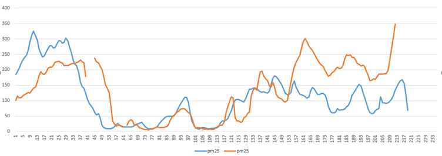
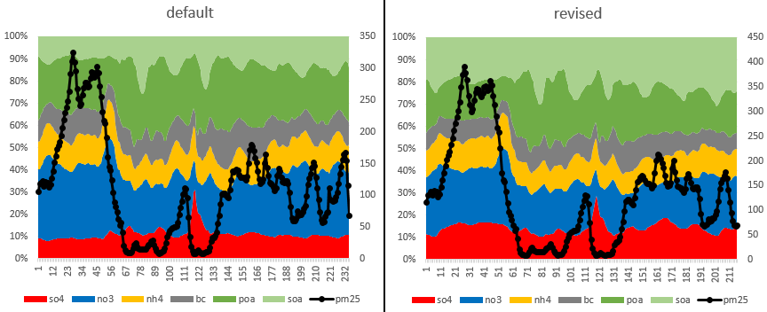
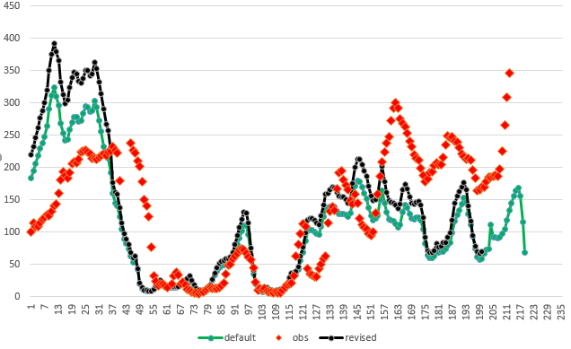
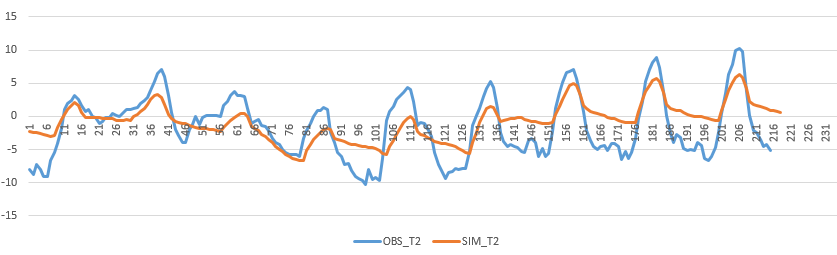

## 运行历史记录

1. 第一次运行
   - 参数化方案选择组里常用，和Li et al., 2023, EI一致
   - chembdy没有打开，只有初始场
   - d02模拟结果和观测对比有偏差，后面几天低估明显

2. 第二次运行(调整不同参数)
   - 改变模型版本（使用revised版本,copy from linan）,其他不变（basecase_RM）
     - 修改模型版本后，SO4, nh4, SOA浓度增加，其他组分不变
     - 
     - 
   - chembdy打开(have_bcs_chem=.ture.)、obsgrid打开（basecase_OBS）
   - 上两种改变同时进行（basecase_RMOBS）
3. 存在问题：
   - 气象模拟不对，温度和RH偏差很大
     - 