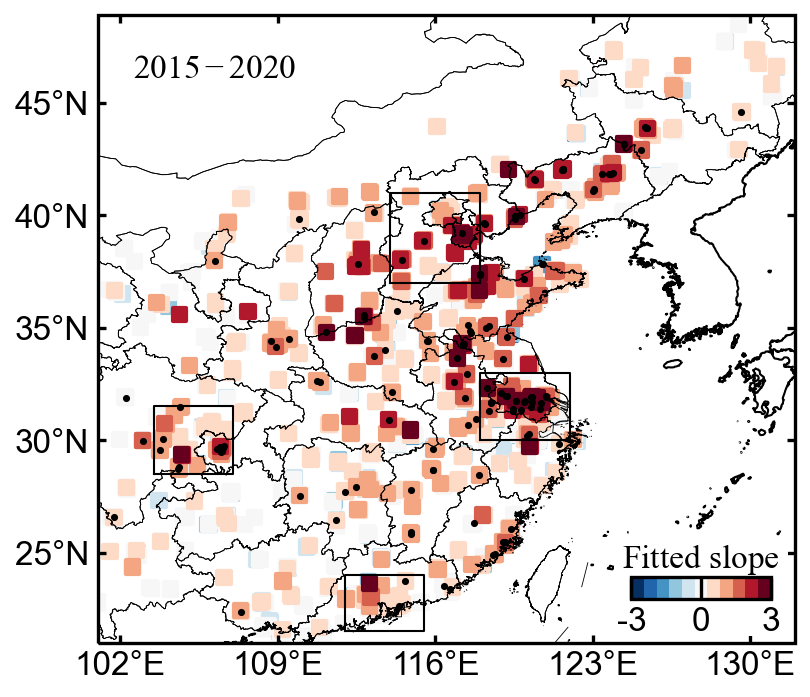

# 站点散点图

- 在地图上添加colorbar，并设置背景色
- 添加方框

```python
dfs = pd.read_csv(f"../obsdata/dMDA8_dPM25_day_station_{season}.csv")
dfs = dfs.sort_values("slope")

def cs_scater(ax, lat,lon,slope,p_value,colors,vmin,vmax):
    cs = ax.scatter(lon, lat,10, slope, cmap=colors,marker="s",vmin=vmin,vmax=vmax)
    cs2 = ax.scatter(lon[p_value<0.1], lat[p_value<0.1], 0.5, c="k")

    ax.add_geometries(china_border.geometries(),
                ccrs.PlateCarree(),edgecolor='k', linewidth=0.2, zorder=2,
                facecolor='none')
    ax.add_geometries(world_border.geometries(),
                ccrs.PlateCarree(),edgecolor='k', linewidth=0.5, zorder=2,
                facecolor='none')
    #标注坐标轴
    ax.set_extent([101,132,21,48])
    ax.set_xticks(np.linspace(102,130,5), crs=ccrs.PlateCarree())
    ax.set_yticks([25,30,35,40,45], crs=ccrs.PlateCarree())
    
    #zero_direction_label用来设置经度的0度加不加E和W
    lon_formatter = LongitudeFormatter(zero_direction_label=False)
    lat_formatter = LatitudeFormatter()
    ax.xaxis.set_major_formatter(lon_formatter)
    ax.yaxis.set_major_formatter(lat_formatter)
    
    for region, pts in cornersdict.items():
        ax.plot([pts[0],pts[1],pts[1],pts[0],pts[0]],[pts[2],pts[2],pts[3],pts[3],pts[2]],'k-',lw=0.5)
        
    return cs

proj = ccrs.PlateCarree()
fig = plt.figure(figsize=(3,3))
ax = fig.add_subplot(1,1,1, projection=proj) 

cs = cs_scater(ax,dfs.lat,dfs.lon,dfs.slope.values,dfs.p.values,cmaps.CBR_coldhot,-3,3)

cbbox = ax.inset_axes([0.74, 0.01, 0.25, 0.15])
[cbbox.spines[k].set_visible(False) for k in cbbox.spines]
cbbox.tick_params(axis='both', left=False, top=False, right=False, bottom=False, labelleft=False, labeltop=False, labelright=False, labelbottom=False)
cbbox.set_facecolor('w')
caxes = cbbox.inset_axes([0.1, 0.4, 0.8, 0.23])
cbar = fig.colorbar(cs,orientation="horizontal",cax=caxes)
cbar.ax.tick_params(axis='x', direction='in',length=5)
cbar.set_label("$Fitted\ slope$",loc="center",labelpad=-23)
cticks= [-3,0,3]; cbar.set_ticks(cticks); cbar.set_ticklabels(cticks)

ax.text(0.05,0.9,"$2015-2020$",transform=ax.transAxes,ha="left")

plt.savefig(f'../figures/dMDA8_dPM25_day_station_{season}',bbox_inches='tight',pad_inches = 0.05, dpi=300, facecolor='w')

```

