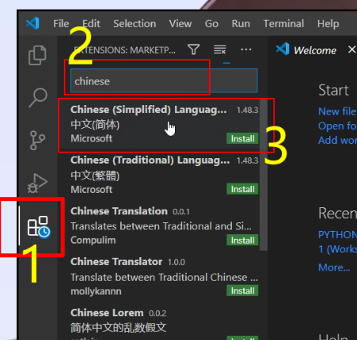

# Hexo 博客常见问题

#### 图片问题

- 参考 https://github.com/cocowool/hexo-image-link
- 安装hexo-image-link

#### 新建博客

``` hexo new name```

# Hexo gitee 搭建博客

#### 必须的软件：

**node.js**

node.js官方网站：[http://nodejs.cn/download/](https://ihcll.cn/?golink=aHR0cDovL25vZGVqcy5jbi9kb3dubG9hZC8=)

node.js阿里云镜像站：[https://npm.taobao.org/mirrors/node/](https://ihcll.cn/?golink=aHR0cHM6Ly9ucG0udGFvYmFvLm9yZy9taXJyb3JzL25vZGUv)

**Git**

Git官网(下载速度可能稍慢)：[https://git-scm.com/](https://ihcll.cn/?golink=aHR0cHM6Ly9naXQtc2NtLmNvbS8=)

Git阿里云镜像站（推荐）：[https://npm.taobao.org/mirrors/git-for-windows/](https://ihcll.cn/?golink=aHR0cHM6Ly9ucG0udGFvYmFvLm9yZy9taXJyb3JzL2dpdC1mb3Itd2luZG93cy8=)

#### 可根据个人喜好替换的软件：

**Visual Studio Code**

官方网站：[https://code.visualstudio.com/Download](https://ihcll.cn/?golink=aHR0cHM6Ly9jb2RlLnZpc3VhbHN0dWRpby5jb20vRG93bmxvYWQ=)

**typora**

官方网站：[https://www.typora.io/](https://ihcll.cn/?golink=aHR0cHM6Ly93d3cudHlwb3JhLmlvLw==)

以上软件若你下载速度慢，可以在这篇文章底部找到我已经下载好了的国内链接，链接里不定期更新以上软件的版本（保证均从官网下载下来不做任何修改）。当然最好是自己去官网下，因为我懒，更新不会很频繁，除非你催我一下（发邮件或者其他什么的）……

#### 要用到的框架或平台：

**Hexo**

官方网站：[https://hexo.io/zh-cn/](https://ihcll.cn/?golink=aHR0cHM6Ly9oZXhvLmlvL3poLWNuLw==)

**Gitee（码云）**

官方网站：[https://gitee.com/](https://ihcll.cn/?golink=aHR0cHM6Ly9naXRlZS5jb20v)

#### 安装说明

node.js和Typora就不说了，这个灰常简单。

至于Git，它安装的时候选项挺多的，而且还都是洋文，看不懂的话就全部选 next 就行了。你要是非得搞明白它每个选项的意思，emmmm那建议你们自己去搜吧，网上一搜一大把。我反正是不知道每项的意思，（全是废话…）我也不想知道~/手动狗头

VsCode安装好之后默认是英文界面，可以在插件市场里搜索chinese，然后安装之后重启软件，就是中文版了。




Code 设置中文

#### 检验是否成功安装

用 Win + R 打开运行，输入 cmd 并进入cmd窗口

##### node.js 的检查

```
 node -v
```

##### npm的检查

NPM是随同NodeJS一起安装的包管理工具，能解决NodeJS代码部署上的很多问题

```
 npm -v
```

##### Git 的检查

```
 git --version
```

以上有显示版本号，则说明安装成功

#### Hexo的安装

##### 1、安装之前可以先设置一下淘宝镜像加速器

```
 npm install -g cnpm --registry=https://registry.npm.taobao.org
```

##### 2、全局安装框架

```
 npm install hexo-cli -g
```

##### 3-1、创建你的博客目录

```
 hexo init 你博客的文件夹名字
```

##### 3-2、进入你博客的目录

```
 cd 你博客的文件夹名字
```

##### 4、复制文件到你博客的目录

```
 npm install
```

##### 5、安装Hexo部署插件

请在你博客的目录下启动cmd，再执行以下代码

```
npm install hexo-deployer-git --save
```

#### Git的配置

用 Win + R 打开运行，输入 cmd 并进入cmd

##### 设置用户名称

```
git config --global user.name "用户名"
```

##### 设置用户邮箱

```
git config --global user.email "用户邮箱"
```

##### 生成密钥

```
ssh-keygen -t rsa -C "用户邮箱"
```

以上代码执行之后，会让你设置密码，推荐一个都不要设置，直接连按三次回车键。

#### 博客 _config.yml 文件的配置

打开你博客根目录的 _config.yml 文件，将一下信息添加到里面去。

```
deploy:

  type: git

  repo: https://gitee.com/hcllmsx/hcllmsx.git    #替换成你自己仓库的HTTP URL地址

  branch: master
```

【注意区分】你博客根目录的 _config.yml 文件，和主题根目录的 _config.yml 文件！

#### Hexo常用代码

##### 1、清理缓存

```
hexo cl
```

hexo cl 是 hexo clean 的简写

##### 2、生成静态页面

```
hexo g
```

hexo g 是 hexo generate 的简写

##### 3、在本地映射（预览）

```
hexo s
```

hexo s 是 hexo server 的简写

##### 4、部署推送

```
hexo d
```

hexo d 是 hexo deploy 的简写

##### 5、以上连写示例一（清理缓存 + 生成静态页面 + 在本地预览）

```
hexo cl && hexo g && hexo s
```

##### 6、以上连写示例二（清理缓存 + 生成静态页面 + 部署推送）

```
hexo cl && hexo g && hexo d
```

#### 资源下载

由于国内打开国外网站的速度有时候是看运气的，所以如果你下载很慢……可以选择下载我这里下载好的。另外，新建文章的通用模板也在里面，有了它可能会非（mei）常（you）方（luan）便（yong）。最后再再再再重申一次，尽量还是自己下载最新版，因为我更新挺懒的，除非你催我。

链接：[https://msx.lanzoui.com/b0ewfyypa](https://ihcll.cn/?golink=aHR0cHM6Ly9tc3gubGFuem91aS5jb20vYjBld2Z5eXBh)  密码：3t1u