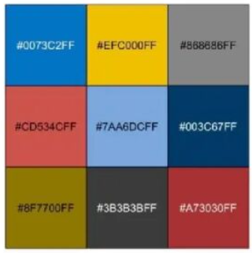

# 绘图样式配置

```python
import matplotlib.pyplot as plt
from matplotlib.mathtext import _mathtext as mathtext
mathtext.FontConstantsBase.sup1 = 0.5
mathtext.FontConstantsBase.sub1 = 0.3
mathtext.FontConstantsBase.sub2 = 0.3

config = {
    "font.family": 'sans-serif',
    "font.sans-serif": ["Arial"],
    "font.size": 8,
    "pdf.fonttype" : 42,
    "mathtext.fontset": "custom",
    'mathtext.rm' : 'Arial',
    'mathtext.it' : 'Arial:italic',
    'mathtext.bf' : 'Arial:bold',
    
    "mathtext.default": "rm",
    "font.weight": 'normal',
    "axes.labelweight": 'normal',
    
    'xtick.direction': 'in',
    'xtick.major.size':  2,
    'xtick.major.width': 1,
    'xtick.minor.size':  1,
    'xtick.minor.width': 1,
    'xtick.major.pad':   2,
    
    'ytick.direction': 'in',
    'ytick.major.size':  2,
    'ytick.major.width': 1,
    'ytick.minor.size':  1,
    'ytick.minor.width': 1,
    'ytick.major.pad':   2,
}
plt.rcParams.update(config)
```

# 创建子图的方法

## 方法1

```python
fig, axs= plt.subplots(4,3,figsize=(5,5),sharex=False,sharey=False)
fig.subplots_adjust(hspace=0.1,wspace=0.2)
axs = axs.flatten()
```

## 方法2

```python
fig = plt.figure(figsize=(6,2))
gs = gridspec.GridSpec(nrows=2, ncols=1, height_ratios=[1.4,2])

fig.subplots_adjust(hspace=0.,wspace=0.28)
##################################################################################################
ax1 = fig.add_subplot(gs[0,:])
ax2 = fig.add_subplot(gs[1,:])
axs = [ax1,ax2]
```

## 方法3

```python
fig = plt.figure(figsize=(8, 6))

ax1= fig.add_subplot(3,3,1)
ax2= fig.add_subplot(3,3,2)
ax3= fig.add_subplot(3,3,4)
ax4= fig.add_subplot(3,3,5)
ax5= fig.add_subplot(3,3,7)
ax6= fig.add_subplot(3,3,8)

ax7= fig.add_subplot(2,3,3)
ax8= fig.add_subplot(2,3,6)
```

## 方法4

- 方法3间隔较大，方法4更好

```python
fig = plt.figure()
fig.set_figheight(6)
fig.set_figwidth(6)
ax1 = plt.subplot2grid((3, 6), (0, 0), colspan=2)
ax2 = plt.subplot2grid((3, 6), (0, 2), colspan=2)
ax3 = plt.subplot2grid((3, 6), (0, 4), colspan=2)
ax4 = plt.subplot2grid((3, 6), (1, 0), colspan=2)
ax5 = plt.subplot2grid((3, 6), (1, 2), colspan=2)
ax6 = plt.subplot2grid((3, 6), (1, 4), colspan=2)
ax7 = plt.subplot2grid((3, 6), (2, 0), colspan=3)
ax8 = plt.subplot2grid((3, 6), (2, 3), colspan=3)
```


# 添加网格线

```python
ax.axhline(y=0.0, color='black', linestyle='-', linewidth=.5)
ax.axvline(x=0.0, color='black', linestyle='-', linewidth=.5)
```

# 自动次要刻度线

```python
ax.minorticks_on()
```

# 添加垂直方向灰色线条

```python
kwargs = {"alpha":0.5,"color":"grey","ec":None}
ax.axvspan(x[0], x[snight],**kwargs )
for i in range(ndays-1):
    ax.axvspan(x[enight+i*24],x[snight+24+i*24],**kwargs)
    ax.axvspan(x[enight+(ndays-1)*24],x[-1],**kwargs)
```


# 颜色循环

```python
from mycolorpy import colorlist as mcp
cmap=mcp.gen_color(cmap="cividis",n=11)

cmap = cmaps.MPL_Dark2.colors[::-12,:]   
cmap = cmap[0:10,:]
cmap = cmap[::-1,:]

import matplotlib as mpl
mpl.rcParams['axes.prop_cycle'] = mpl.cycler(color=["#ef476f","#ffd166","#06d6a0","#118ab2","#073b4c"])

color = ["#0073C2FF","#EFC000FF","#868686FF","#CD534CFF","7AA6DCFF","#003C67FF","#8F7700FF","#3B3B3BFF","#A73030FF"]
```



# 改变x轴刻度标记

```python
x = np.linspace(0,53,54)
xx = x-21
xx = [int(i) for i in xx]
xtinc = 7
x_ticks=ax.set_xticks(x[::xtinc])
x_labels=ax.set_xticklabels(xx[::xtinc], # 标签
                            rotation=0,  # 旋转
                            fontdict={'family': 'SimHei', 'fontsize': fontsize})  #字体
ax.tick_params( labelsize=fontsize) # 设置坐标轴tick字体
ax.tick_params(axis='both', direction='in', length=6, labelsize=fontsize, width=0.5) # 方向，长度等

# 设置刻度间隔
from matplotlib.pyplot import MultipleLocator
x_major_locator=MultipleLocator(1) #把x轴的刻度间隔设置为1，并存在变量里
y_major_locator=MultipleLocator(10) #把y轴的刻度间隔设置为10，并存在变量里
ax.xaxis.set_major_locator(MultipleLocator(1)) #把x轴的主刻度设置为1的倍数
ax.yaxis.set_major_locator(y_major_locator) #把y轴的主刻度设置为10的倍数

# which select the major or minor ticks; 
# axis select the x or y axis
ax.tick_params("both", which='major', length=15, width=2.0, colors='r', direction='in') #"y", 'x', 'both'
ax.tick_params(which ='minor', length=5, width=1.0, labelsize=10, labelcolor='0.6', direction='in')

ax.get_xaxis().set_visible(False)
ax.spines['top'].set_visible(False)
ax.spines['bottom'].set_visible(True) # 可见
axi.spines['bottom'].set_linewidth(0.5) # 线条粗细
axi.spines['left'].set_linewidth(0.5)
```

# legend设置

```python
ax.legend(frameon =False, # 边框
          ncol=3, # 列数量
          loc=8,  # 位置
          bbox_to_anchor=(1., 0.2), # 位置
          borderaxespad =12.8,  # 距离axes轴位置
          handletextpad =0.1,   # handle和文件距离
          columnspacing=0.5,    # 列间距
          labelspacing=0.1,     # 行间距
          handlelength=1.,      # handle长度
          prop={'family': 'SimHei','size':6} ) # 字体设置

import itertools
def flip(items, ncol):
    return itertools.chain(*[items[i::ncol] for i in range(ncol)])
cat_order = ['0-12 h', '12-24 h', '24-36 h', '36-48 h', '48-60 h','60-72 h','72-84 h', '84-96 h', '96-108 h', '>108 h']
n1 = []
for i in range(nbins):
    n1.append(ax.bar(0, 0,color=cmap[i]))
l1 = ax.legend(flip(n1,5),flip(cat_order,5), loc=[0, -0.3], frameon=False,ncol=5, handletextpad=0.5, columnspacing=1.5, handlelength=1.5)
ax.add_artist(l1)
```

# 添加文字

```python
ax.text(-0.05, 0.5, vtitle,
        fontsize=15,va='center',ha='left/right/center',style='italic',rotation='vertical',weight='bold',  # 大小，剧中，斜体，垂直方向，粗体
        transform=ax.transAxes,  # 
        c = 'r', # 颜色
        fontdict={'family': 'SimHei', 'fontsize': 10}) # 字体等

fig.text(0.08, 0.32, "$Mass\ concentration\ (\mu g\ m^{-3})$", color='k', ha='center',va="center",rotation="vertical")
fig.text(0.08, 0.87, "(A)", color='k', ha='center',va="center",fontsize=10)
fig.text(0.13, 0.51, "M17E13", color='k', ha='center',va="center",rotation="vertical",fontweight="bold",fontsize=8.)
```

# 设置colorbar

```python
position=fig.add_axes([0.17, 0.12, 0.7, 0.02])
cbar = plt.colorbar(cs,orientation="horizontal",cax=position)
cbar.ax.tick_params(axis='x', direction='in',length=20,labelsize=15)
```

# 公用x、y轴

```python
fig, axs = plt.subplots(4, 1, sharex=True)  # figsize=(8, 4))
fig.subplots_adjust(hspace=0, wspace=0)

fig, axs = plt.subplots(5,4,figsize=(12,12),subplot_kw={'projection':proj},sharex=True,sharey=True)
fig.subplots_adjust(hspace=0.0,wspace=0.01)        
```

# 设置cbar

```python
if(ibin==4):
    l, b, w, h = ax1.get_position().bounds
    print(l, b, w, h)
    b, h = 0.09, 0.12
    position=fig.add_axes([l+0.02, b, 0.16, h/10]) #位置[左,下,长，高]
    cbar = plt.colorbar(cs1,cax=position,orientation="horizontal")
    cbar.ax.tick_params(axis='x', direction='in',length=10,labelsize=15)
    cticks= np.linspace(zmin, zmax, num=11, dtype=int); cbar.set_ticks(cticks); cbar.set_ticklabels(cticks)
```


# 字体设置

- 下载字体https://www.download-free-fonts.com/，复制到matplotlib对应字体目录下```/r008/xdxie/software/anaconda3/lib/python3.8/site-packages/matplotlib/mpl-data/fonts/ttf```，删除home目录下的.cache/matplotlib文件夹，添加下面的语句，就可以了

```python
import matplotlib.font_manager as font_manager
fontpath = "/r008/xdxie/software/anaconda3/lib/python3.8/site-packages/matplotlib/mpl-data/fonts/ttf/times new roman.ttf"
prop = font_manager.FontProperties(fname=fontpath)
plt.rcParams['font.family'] = prop.get_name()


import matplotlib.pyplot as plt 
plt.rcParams['font.sans-serif'] = ['SimHei']#用来显示中文标签
plt.rcParams['axes.unicode_minus'] = False#用来正常显示负号

# 单独设置text字体
ax.text(116.0,40.25,  u'北京',fontfamily=prop.get_name())

# windows下字体目录 C:/windows/fonts
```


**解决方案**

网上有好几个解决方案，只介绍自己实战可行的。

**1. 查看matplotlib字体位置**

```
python
import matplotlib 
print(matplotlib.matplotlib_fname())

#记录下来，字体位置我的是：/home/ruanjianlaowang/anaconda3/lib/python3.7/site-packages/matplotlib/mpl-data/matplotlibrc

exit()
```

**2. 上传字体到服务器**

```
cd /home/ruanjianlaowang/anaconda3/lib/python3.7/site-packages/matplotlib/mpl-data/fonts/ttf

通过ftp或者其他方式，将字体传上去，我们传的是：simhei.ttf
```

**3. 删除字体缓存**

```
cd  ~/.cache/matplotlib
rm -rf *
```

**4. 重启python应用**

```
nohup python k-means.py &
```

**说明：** 假如还没生效，再更改个配置文件试试。（我们以前没更改这个配置文件，但是这次发生了个插曲，这次用的jmeter测试，一直还是乱码，后来改了这个还是不行，原来是jmeter的问题）

```
cd  /home/ruanjianlaowang/anaconda3/lib/python3.7/site-packages/matplotlib/mpl-data

vi matplotlibrc 
font.family         : sans-serif  #去掉前面的#
font.serif          : simhei, DejaVu Serif,   #新加了simhei
```