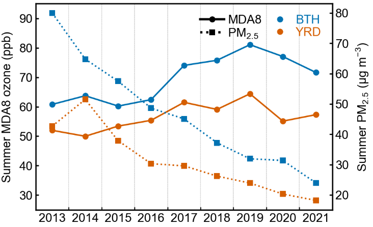

```python
fig, ax = plt.subplots(figsize=(3,2))

args = {"ms":2,"lw":1.}
x = np.linspace(0,30,31)
ax.plot(x,s2data13,'b^--',**args)
ax.plot(x,s2data17,'r^--',**args)

ax.plot(x,s2data1713,'g^--',**args)

ax.plot(data13,'b.-',**args)
ax.plot(data17,'r.-',**args)
ax.plot([],'k.-',label='OBS',**args)
ax.plot([],'k^--',label='SIM',**args)

mo,mp,bias,ME,MNB,MNE,MFB,MFE,NMB,NME,RMSE,R,IoA = evaluation(data13, s2data13)
ax.text(0.99, 0.84, r"$R=%4.2f,\ NMB=%4.1f\%%,\ NME=%4.1f\%%$" % (R,NMB*100,NME*100), color='b',  transform=ax.transAxes,ha='right',fontsize=6.)
mo,mp,bias,ME,MNB,MNE,MFB,MFE,NMB,NME,RMSE,R,IoA = evaluation(data17, s2data17)
ax.text(.99, 0.91, r"$R=%4.2f,\ NMB=%4.1f\%%,\ NME=%4.1f\%%$" % (R,NMB*100,NME*100), color='r',  transform=ax.transAxes,ha='right',fontsize=6.)
ax.text(.3, 0.84,'2013', color='b',  transform=ax.transAxes,ha='right',fontsize=6.)
ax.text(.3, 0.91,'2017', color='r',  transform=ax.transAxes,ha='right',fontsize=6.)


# ax.axhline(y=100,color='r',lw=0.5,ls='--',alpha=0.5)
# ax.axhline(y=180,color='b',lw=0.5,ls='--',alpha=0.5)
ax.axhline(y=150,color='k',lw=0.5,ls='--',alpha=0.5)
ax.set_ylim(0,340)
ax.yaxis.set_major_locator(MultipleLocator(50.))
ax.yaxis.set_minor_locator(MultipleLocator(10.))

ax.set_xticks(np.linspace(0,30,6))
ax.set_xticks(np.linspace(0,30,31),minor=True)
ax.set_xticklabels(["01-01","01-07","01-13","01-19","01-25","01-31",])
ax.legend(loc=2, frameon=False,ncol=1, handletextpad=0.3, labelspacing =0.3, handlelength=1.,fontsize=6)

figname = f"{homepath}/figures/CEC_regionmean.png"
plt.savefig(figname, dpi=300, bbox_inches='tight',pad_inches = 0.05, facecolor='w') 
```


```python
config = {
    'xtick.major.size':  0,
    'xtick.minor.size':  2,
    'ytick.major.size':  2,
    'ytick.minor.size':  1,
}
plt.rcParams.update(config)

seasondict = { 'Spring':(25,75),
               'Summer':(25,95),
               'Autumn':(18,68),
               'Winter':(8,45)}
xx = np.array([1,2,3,4,5,6,7,8,9])

for season,ylims in seasondict.items():
    dfs = pd.read_csv(f"../obsdata/MDA8trends_{season}.csv")    
    arr2d10 = dfs[['2013','2014','2015','2016','2017','2018','2019','2020','2021']].values
    arr2d11 = dfs.query("region == 'NCP'")[['2013','2014','2015','2016','2017','2018','2019','2020','2021']].values
    arr2d12 = dfs.query("region == 'FWP'")[['2013','2014','2015','2016','2017','2018','2019','2020','2021']].values
    arr2d13 = dfs.query("region == 'YRD'")[['2013','2014','2015','2016','2017','2018','2019','2020','2021']].values

    dfs = pd.read_csv(f"../obsdata/pm25trends_{season}.csv")    
    arr2d20  = dfs[['2013','2014','2015','2016','2017','2018','2019','2020','2021']].values
    arr2d21 = dfs.query("region == 'NCP'")[['2013','2014','2015','2016','2017','2018','2019','2020','2021']].values
    arr2d22 = dfs.query("region == 'FWP'")[['2013','2014','2015','2016','2017','2018','2019','2020','2021']].values
    arr2d23 = dfs.query("region == 'YRD'")[['2013','2014','2015','2016','2017','2018','2019','2020','2021']].values

    fig, ax = plt.subplots(figsize=(3.5,2.5))

    ax.plot(xx,    np.nanmean(arr2d11,axis=0),'o-',ms=3,color='C0',lw=1.,zorder=2)
    ax.plot(xx,np.nanmean(arr2d13,axis=0),'o-',ms=3,color='C2',lw=1.,zorder=2)
    
    axw = ax.twinx()
    axw.plot(xx,    np.nanmean(arr2d21,axis=0),'s:',ms=3,color='C0',lw=1.,zorder=2)
    axw.plot(xx,np.nanmean(arr2d23,axis=0),'s:',ms=3,color='C2',lw=1.,zorder=2)
    
    ax.plot([],'ko-',ms=3,label="MDA8")
    ax.plot([],'ks:',ms=3,label="$PM_{2.5}$")
    ax.plot([],'.',color='C0',label="BTH")
    ax.plot([],'.',color='C2',label='YRD')

    for i in range(8):
        ax.axvline(x=1.5+i,ls='--',lw=0.1,c='k')
    leg = ax.legend(frameon=False,ncol=2,loc=1, handletextpad =0.3,   # handle和文字距离
        columnspacing=0.5, labelspacing=0.1,  handlelength=2., )
    for h, t in zip(leg.legendHandles, leg.get_texts()):
        t.set_color(h.get_color())
        
    ax.set_xlim(0.5,9.5)
    ax.set_ylim(ylims)
    ax.set_xticks(xx)
    ax.set_xticklabels(years,rotation=0.)
    ax.set_xticks(xx+0.5,minor=True)
    ax.set_ylabel(f"{season} MDA8 ozone (ppb)")
    axw.set_ylabel(f"{season} " +  "$PM_{2.5}\ (\mu g\ m^{-3})$")
    plt.savefig(f'../figures/pm25MDA8_trends_{season}',bbox_inches='tight',pad_inches = 0.05, dpi=300, facecolor='w')
```



