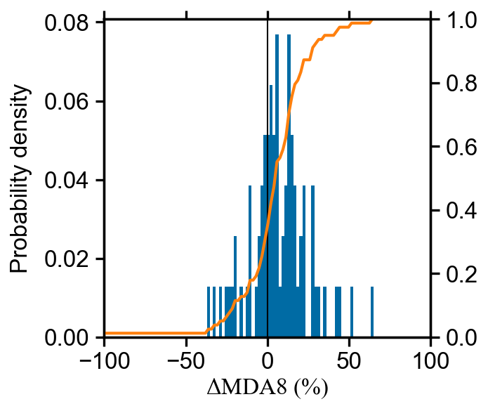

```python
y1 = orgdata["O3"]
y2 = dwedata["O3"]

config = {
    'xtick.direction': 'in',
    'xtick.major.size':  2,
    'xtick.minor.size':  1,
    'ytick.direction': 'in',
    'ytick.major.size':  2,
    'ytick.minor.size':  1,
    'axes.labelpad': 2.0,
}
plt.rcParams.update(config)

fig, ax = plt.subplots(1,1,figsize=(4,2))

ax.hist(y1, 50, histtype='step', stacked=True, fill=False, density=True,label=["Obs."])

ax.hist(y2, 50, histtype='step', stacked=True, fill=False, density=True,label=["De-weather"])

pmax = 0.02
ax.set_yticks(np.linspace(0,pmax,5))
ax.set_yticklabels(np.linspace(0,pmax*1000,5,dtype=int))

ax.set_ylabel(r'$Probability\ density\ (\times 10^{-3})$')
ax.legend()

ax.set_xlabel(r"$O_{3}\ concentrations\ (\mu g\ m^{-3})$")
figname = f"{homepath}/figures/O3_pdf.png"
plt.savefig(figname, dpi=300, bbox_inches='tight',pad_inches = 0.05, facecolor='w') 
```


```python

x = dfs.a

num_bins = 50

fig, ax = plt.subplots(figsize=(2,2))

# the histogram of the data
values, base, _  = ax.hist(x, num_bins, density=True,ec="k",lw=0.1)

ax_bis = ax.twinx()
values = np.append(values,0)
ax_bis.plot( base, np.cumsum(values)/ np.cumsum(values)[-1], color='darkorange', marker='o', linestyle='-', markersize = 1)

ax.set_xlabel('slope')
ax.set_ylabel('Probability density')
ax.axvline(x=0,c='k',lw=0.5)

fig.tight_layout()
plt.savefig('../figures/slope_histogram',bbox_inches='tight',pad_inches = 0.05, dpi=300, facecolor='w')
```


```python
def pdf_cdf(ax, y, num_bins = 100):
    res_freq = stats.relfreq(y,num_bins)
    pdf_value = res_freq.frequency
    cdf_value = np.cumsum(pdf_value)
    x = res_freq.lowerlimit + np.linspace(0,res_freq.binsize*(res_freq.frequency.size-1), res_freq.frequency.size)

    ax.bar(x,pdf_value,width=res_freq.binsize,color=colorblind[0],lw=0.2)
    axw = ax.twinx()
    axw.plot(x,cdf_value,'-',c=colorblind[1],lw=1)
    axw.set_ylim(0,1)

    ax.set_xlabel('$\Delta{MDA8}\ (\%)$',labelpad=1)
    ax.set_ylabel('Probability density')
    ax.set_xlim(-100,100)
    ax.axvline(x=0,lw=0.5,color='k')
    print(cdf_value[np.where(x>0)])
    
fig, ax = plt.subplots(1,1,figsize=(2,2))
pdf_cdf(ax, y)
figname = f"{homepath}/figures/pdf_cdf_{city}.png"
plt.savefig(figname, dpi=300, bbox_inches='tight',pad_inches = 0.05, facecolor='w') 
```

