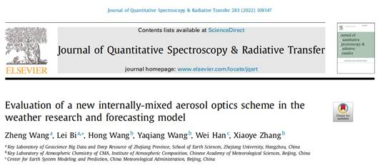

# Evaluation of a new internally-mixed aerosol optics scheme in the weather research and forecasting model

- 背景介绍

  ​	

  - 重要性，模式中的关键参数：bext, SSA, G
    - The key parameters describing the aerosol–radiation interaction in the weather/climate models are aerosol optical properties, including the extinction coefficient, single scattering albedo (SSA), and asymmetry factor (G).

  - 影响因素
    - 形貌的影响
      -   米散射理论的球形假设简单高效，目前广泛使用
      -   非球形模型的发展取得了实质性进展。用于沙尘的非球形模型包括椭球体(ellipsoid)、超球体(super-spheroid)、不规则六面体(irregular hexahedral)等；分形聚合模型(fractal aggregate model)常用于BC。
    - 混合态的非均匀性
      -  与外混相比，BC与其他非吸收性气溶胶的内混会增强对辐射的吸收
  - 目前模式中处理方式
    - WRF-chem: 米散射算法，BC核，其他壳
    - CAM5-ATRAS: 查表法 参数化 BC和其他物种内混
    - MATCH-SALSA: pure BC as fractal aggregate, 使用core-grey-shell模型计算光学特性

- 方法

  - WRF-Chem
    - well-mixed aerosols: 假设为球形，有效折射指数为体积平均折射指数
    - internal mixing aerosols：壳的有效折射指数为体积平均

# Fully coupled ‘‘online’’ chemistry within the WRF model

- Grell et al., AE, 2005
- MADE with SORGAM 气溶胶模块
  - size distribution: 3模态+log-normal distribution
  - aerosol processes: nucleation, condensation, and coagulation (coagulation 考虑Aitken model的两个粒子碰并和增长，进入accumulation model)
  - 

# Evolution of ozone, particulates, and aerosol direct radiative forcing in the vicinity of Houston using a fully coupled meteorology-chemistry-aerosol model

- Fast J D et al., 2006, JGR
- MOSAIC-8bins
  -  The bins are defined by their lower and upper dry particle diameters, so water uptake or loss does not transfer particles between bins.
  - internally mixed within each bins
  - Particle growth or shrinkage resulting from uptake or loss of trace gases (H2SO4, HNO3, HCl, NH3, and eventually secondary organic species) is first calculated in a Lagrangian manner. Transfer of particles between bins is then calculated using either the two-moment approach [Tzivion et al., 1989], as in this study, or the moving center approach [Jacobson, 1997] with these growth rates.
- aerosol optical properties
  - extinction $b_{ext}$, SSA ($\varpi_0$), and g are computed as a function of wavelength, $\lambda$ and three-dimensional position $x$.
  - 米散射理论用于计算消光系数$Q_e$、散射系数$Q_s$和不对称因子$g'$
    - $b_{ext}(\lambda,x)=\sum{Q_e(x_i,x)\pi r_i^2 n(r_i,x)}$
  - radiative transfer model: Goddard shortwave radiative model
    - radiative model consists of 11 shortwave bands
    - **but aerosol optical properties are calculated in 4 bands: 0.3, 0.4, 0.6, and 1.0 $\mu m$**

# Technical Note: Evaluation of the WRF-Chem “Aerosol Chemical to Aerosol Optical Properties” Module using data from the MILAGRO campaign

- Barnard et al., 2010 ACP

- from chemical to optical properties (based on MOSAIC bins):

  1. masses, $M_{i,j}$, and number, $N_{i}$, are computed by each bins. i and j represent size bin number and chemical species
  2. convert mass $M_{i,j}$ to volumes $V_{i,j}$, by dividing by the density of each species
  3. calculate physical diameter, $D_{p,i}$ by summing over all $V_{i,j}$ in a bin, so $D_{p,i}=2((\sum{V_{i,j}/N_{i}})/\frac{4}{3}\pi)^{1/3})$, then the size distribution is defined by $N_{i}$ and associated $D_{p,i}$
  4. calculate bulk refractive index of the particles in a bin based on the size distribution. To do this, we need to choose a refractive index mixing rule: spherical shell/core configuration (以BC为核的球状核壳模型)。 
     - $m_{s,i}$ and $m_{c,i}$ represent bulk complex refractive index of the shell and core. 
     - $m_j$ be the refractive index of each of the chemical constituents $j$.
     - $m_{s,i}=\frac{\sum{m_j V_{i,j}}}{\sum{V_{i,j}}}$
     - $m_{c,i}=1.85+i0.71$
  5. 使用米散射理论计算吸收系数$Q_{a,i}$、散射系数$Q_{s,i}$和不对称因子$g_i$ for each bin, 进而得到整体的光学性质(输出到辐射模块)：
     - $B_{scat}=\sum_{i=1}^{8 bins}{N_i Q_{s,i} \pi (\frac{D_{p,i}}{2})^2}$
     - $B_{abs}=\sum{N_i Q_{a,i} \pi (\frac{D_{p,i}}{2})^2}$
     - $g=\frac{\sum{N_i Q_{s,i} \pi (\frac{D_{p,i}}{2})^2 g_i}}{\sum{N_i Q_{s,i} \pi (\frac{D_{p,i}}{2})^2}}$

  

# 米散射原理

- 散射原理：入射波照射粒子，使得粒子磁化，感应出复杂电荷和电流分布。它们以同样频率变化，向外辐射电磁波就是散射
- 粒子直径D和入射波长$\lambda$ : $D/\lambda<<1$ 散射 $D/\lambda==1$ 衍射 $D/\lambda>1$ 反射
- 入射波长 $\lambda==550\ nm$ 粒子直径$2*2.5\mu m$ 
- 根据粒子直径可以将散射分成： 瑞利散射、米散射
  - 定义尺度参数$\chi=2\pi r/\lambda$
  - 瑞利散射：半径r<<$\lambda$， 判断条件：$\chi = 2\pi r/\lambda < 0.13$ ; $\chi<0.1$ 或$r<0.05\mu m$
  - 米散射：当$\chi= 2\pi r/\lambda > 0.13$ 时，瑞利散射会产生较大偏差。故而引入米散射算法,判断条件：$\chi>0.1-0.3$