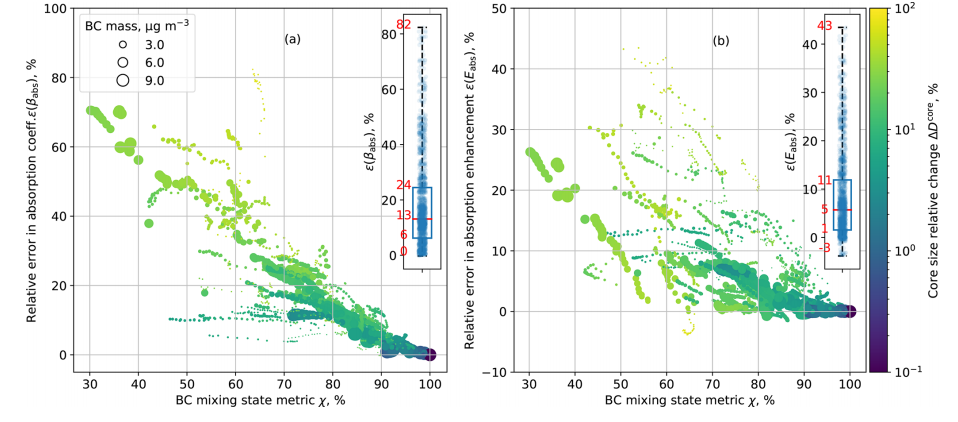
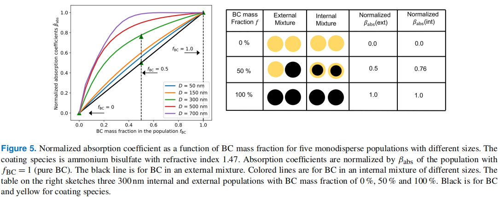

# 光学性质关键参数

- 消光系数 extinction coefficient $b_{ext}$ 或 $\sigma_{ext}$, 散射系数 scattering coefficient $\sigma_{sca}$,  吸收系数 absorbing coefficient  $\sigma_{abs}$， 单位长度的倒数（$cm^{-1}$）
  - 吸收系数等于消光系数和散射系数之差： $\sigma_{abs}=\sigma_{ext}-\sigma_{sca}$
- 消光效率 extinction efficiency $Q_{ext}$, 散射效率 scattering efficiency $Q_{sca}$, 吸收效率 absorbing efficiency $Q_{abs}$， 无量纲数
  - 消光效率等于散射效率和吸收效率之和： $Q_{ext}=Q_{sca}+Q_{abs}$
- 消光截面 extinction cross section  $C_{ext}$， 散射截面 scattering cross section $C_{sca}$，吸收截面 absorbing  cross section  $C_{abs}$, 单位为面积（$cm^2$）
- 质量消光截面，质量吸收截面 mass absorption cross section $MAC$
- 区别与联系：
  - 消光系数指单位长度能量的衰减比例，单位为长度的倒数（$cm^{-1}$），等于消光截面和数浓度的乘积：$\sigma_{ext}=C_{ext} \times N$
  - 消光/散射/吸收截面指单个粒子的消光截面，通常使用单位质量的吸收截面，如MAC
  - 消光效率是无量纲数，等于消光截面除以粒子的横截面积：$Q_{ext}=C_{ext}/A$
  - $\sigma_{ext} =  C_{ext} \times N = A \times Q_{ext} \times N = \frac{\pi D_p^2}{4} \times Q_{ext} \times N$
- 单次散射反照率 single-scattering albedo $\omega$ , 等于散射效率和消光效率的比值：$\omega = \frac{Q_{sca}}{Q_{ext}}$
- 不对称因子  asymmetry parameter， $g$

# Angstrom exponent

- $\frac{\tau_{\lambda}}{\tau_{\lambda_0}}=(\frac{\lambda}{\lambda_0})^{-\alpha}$
- 

# 混合态对气溶胶光学性质的影响 (Yao et al., 2022, ACP)

- 气溶胶组分对光学性质有重要影响：
  - 不同组分复折射指数不同
  - 不同组分吸湿性不同，会影响气溶胶含水量，对散射有重要影响
  - 气溶胶粒子中不同组分的混合方式不同（排列方式）对散射、吸收有影响
    - 不含吸收性组分（BC）的粒子中，体积混合可以用于计算整个粒子的折射指数
    - 含BC粒子采用核壳假设（Mie散射算法，球形假设）更为合理，但包裹物对BC的光吸收有增强作用
    - 对非球形粒子更复杂，Scarnato et al., 2013使用离散偶极子近似模型发现完全嵌入NaCl组分中的BC(embeded in NaCl)比部分嵌入BC的吸收系数的增强更大
    - 因此混合状态对气溶胶光学性质有重要影响
  - 大气中粒子混合状态从外混变化到内混，新鲜排放的粒子通常为外混，随着老化过程（粒子间的碰并，气态物种的凝结），逐渐向内混转化
  - Koike et al., 2014发现内混假设使得气溶胶的光学厚度增加2倍以上
- 模型很难描述气溶胶的混合态，进而影响到计算的气溶胶光学性质（吸收截面，散射截面和不对称因子）的准确性
  - 模态法（CMAQ\MAM）：模态间外混，模态内部内混； Fierce et al., 2016 发现忽略含BC气溶胶包裹物厚度的多样性（内混假设认为所有粒子中BC和包裹物含量相同，实际上不同粒子包裹物厚度不一样）会导致模拟的吸收增强高估200%
  - 分粒径区间（MOSAIC，TOMAS，GLOMAP）
  - 二维模型（Matsui et al., 2013, 2017）: 增加了BC混合态，不能表征非BC组分的其他粒子的混合信息（如沙尘）
- 混合态引起的气溶胶光学性质的不确定性
  - 有研究利用敏感性实验进行评估（假设理想情况下，对真实的混合态仍然不清楚 assessed based on differences between varied idealized assumptions, no benchmark simulations exists）
    - Curci et al., 2015发现混合态是气溶胶光学性质（AOD, SSA）不确定性的主要来源（能解释30-35%）
    - Kodros et al., 2018发现内混和外混的假设计算的气溶胶直接辐射强迫变化范围为$-1.65$到$-1.34\ W/m^2$
  - Fierce et al., 2017, 2020 apply detailed particle-resolved benchmark model,发现简单的混合态假设导致BC核和壳的错误分布，并导致吸收估算误差
- 内混假设下气溶胶光学性质的误差有多大？是什么原因导致的？
- 结论：
  - 内混假设普遍高估了气溶胶的吸收系数，且高估随着混合态指数减小而增加（越趋向于外混，高估越明显，因为是和内混假设对比的）。平均高估18%，最大达80%。
    - 这种高估是由于内混假设中BC核的粒径高估导致的
    - 对于单个粒子，吸收系数随着BC核的增加而增加；但对于粒子群来说，内混假设会导致一部分粒子的BC核增加，另一部分粒子的BC核减少（虽然总的BC和会增加）。考虑极端的情况，粒子群分为两个集合，分别为BC占比（$f_{BC}$）很高的和BC占比很低的，内混假设会导致$f_{BC}$很大的部分BC核的粒径减小
    - 
    - 
  - 内混假设普遍低估了气溶胶的散射系数，平均-1.2%，最大-32%
  - 进而导致SSA低估，−0*.*9 % (RH = 0 %), −0*.*7% (RH = 50 %) and −0*.*4% (RH = 90 %). 
  - 但同样的混合态指数下，不同实验结果差异较大，尤其是对于散射系数。对于吸收系数，这种差异是由于内混假设对BC核的粒径的高估差异导致的；对于散射系数，这种差异是由于内混假设中包裹物的折射指数的不同
  - 

- 启示：
  - 内混高估吸收系数，低估散射系数，低估SSA，外混相反，那真实的混合态如何，怎么表征？
  - 目前在做的订正系数的物理意义是什么？
  - 球形假设的不确定性和混合状态的不确定性？Fierce et al., 2020

# 黑碳辐射强迫的不确定性来源

- Fierce et al., 2020

  - 认为主要是混合态的非均一性导致的
  - 黑碳和其他组分混合后会发生光吸收增强现象，但目前对这种光吸收增强的定量评估还存在较大的不确定性，是导致评估黑碳辐射效应不确定性的重要来源
  - 两个可能原因：
    1. 常用的球形假设（核壳模型）高估了黑碳的吸收，即形貌的影响
    2. 粒子间的差异性，即混合状态的影响 （本文认为后者的作用更为重要）
  - 研究方法：
    1. 类似于Liu et al., 2017的方法，使用经验公式对Mie散射公式订正，$E_{abs}=1+\frac{R_{BC}}{R_{BC,0}} \times (E_{abs,c-s}-1)+\epsilon$
    2. 使用粒子解析模式PartMC

- Liu et al., 2017

  - 混合态决定黑碳的吸收增强
  - 观测表明： 外场测得的交通排放BC的数浓度峰值$M_R=0.3$，实验室测得的正常工况下BC数浓度峰值对应的$M_R=1$ （$M_R=M_{non-BC}/M_{rBC}$）
  - 观测的$E_{abs}$在Mie-core-shell和external mixing假设的模拟值之间，因此引入了一种hybrid方法来估算$E_{abs}$ (结合核壳模型和外混模型，假设内混的比例)
    - $M_R<1.5$时，观测的$E_{abs}$与外混假设/不含BC一致，即$E_{abs}=1$
    - $M_R>3$时，观测的$E_{abs}$和Mie-core-shell假设结果$E_{abs,c-s} $相同
    - $M_R$在1.5~3之间时，介于两者之间，引入内混比例$F_{in}$，则
      - $E_{abs}=E_{abs,c-s} \times F_{in} + (1-F_{in}) \times 1$
      - $F_{in}=0.57 \times M_R - 0.74\ (where\ 1.5<M_R<3)$
  - hybrid方法模拟的$E_{abs}$和观测更为一致

##  准确表征混合的模式研究

- Stevens et al., 2022, ACP
  - GEM_MACH
  - 

## 怎么把排放的混合态区分出来