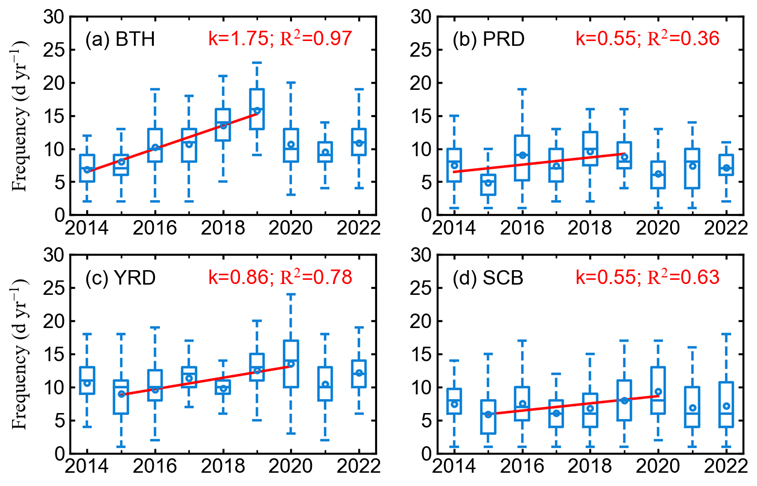

# 箱形图

```python
config = {
    'xtick.direction': 'in',
    'ytick.direction': 'in',
    'xtick.major.size':  2,
    'xtick.minor.size':  1.5,
    'ytick.major.size':  2,
    'ytick.minor.size':  1.5,
    'xtick.top': True,
    'ytick.right': True,  
}
plt.rcParams.update(config)

station = "1001A"; years = [2014,2015,2016,2017,2018,2019,2020,2021,2022]; season = 'Summer'
dfs = pd.DataFrame(columns=["station","region","lat","lon",'2014','2015','2016','2017','2018','2019','2020','2021','2022','slope','p'])
fig, axs = plt.subplots(2,2,figsize=(4.8,3.2))
axs = axs.flatten()
arg = {'widths':0.4,'showfliers':False,'showmeans':True,'meanline':False,
       'boxprops':{'color':'#1084d8'},
       'medianprops':{'color':'#1084d8'},
       'meanprops' : dict(marker='o', markeredgecolor='#1084d8',ms=2,
                      markerfacecolor='none'),
       'whiskerprops':{'color':'#1084d8','ls':'--'},
       'capprops':{'color':'#1084d8'}
      }

for i, region in enumerate(cornersdict.keys()):
    ax = axs[i]
   
    dfres = np.loadtxt(f"../obsdata/dMDA8_dPM25_day_{region}_{season}.csv")
    ax.boxplot(dfres[:,0],positions=[0],**arg)
    ax.boxplot(dfres[:,1],positions=[1],**arg)
    ax.boxplot(dfres[:,2],positions=[2],**arg)
    ax.boxplot(dfres[:,3],positions=[3],**arg)
    ax.boxplot(dfres[:,4],positions=[4],**arg)
    ax.boxplot(dfres[:,5],positions=[5],**arg)
    ax.boxplot(dfres[:,6],positions=[6],**arg)
    ax.boxplot(dfres[:,7],positions=[7],**arg)
    ax.set_ylim(40,101)
    ax.set_xticks([0,1,2,3,4,5,6,7])
    ax.set_xticklabels([-1000, -30,-20,-10,0,10,20,30])
    # ax.axhline(y=100,lw=0.5,c='k')
    # ax.set_xticks([2015,2017,2019,2021],minor=True)
    # ax.yaxis.set_major_locator(MultipleLocator(5))
    
    # x = [2015,2016,2017,2018,2019,2020]
    # y = temp[['2015','2016','2017','2018','2019','2020']].mean()
    # slope, intercept, r_value, p_value, std_err = stats.linregress(x,y)
    # f = np.poly1d([slope, intercept])
    # ax.plot(x, f(x), 'r-',lw=1.)
    # print(r_value,p_value)
    ax.text(0.05,0.85,f"{alpha[i]} {region}",transform=ax.transAxes,ha="left")
    # ax.text(0.45,0.85,"k=%.2f; $R^2$=%.2f" %(slope, r_value**2),transform=ax.transAxes,ha="left",color='r')

axs[0].set_ylabel("$Fraction\ (\%)$")
axs[2].set_ylabel("$Fraction\ (\%)$")

figname = f"{homepath}/figures/dMDA8.dpm25.ratio_summer.png"
plt.savefig(figname, dpi=300, bbox_inches='tight',pad_inches = 0.05, facecolor='w') 

```

