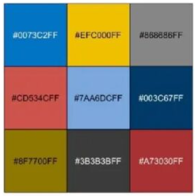
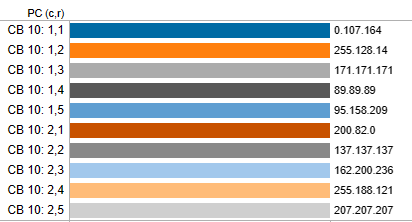
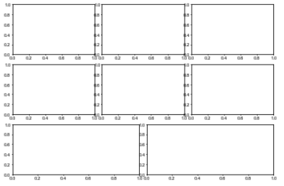

## 导入相关库

```python
import pandas as pd
import matplotlib.pyplot as plt
from matplotlib.mathtext import _mathtext as mathtext
from matplotlib.pyplot import MultipleLocator
mathtext.FontConstantsBase.sup1 = 0.5
mathtext.FontConstantsBase.sub1 = 0.3
mathtext.FontConstantsBase.sub2 = 0.3
import warnings
warnings.filterwarnings("ignore")

config = {
    "font.family": 'sans-serif',
    "font.sans-serif": ["Arial"],
    "font.size": 8,
    "pdf.fonttype" : 42,
    "mathtext.fontset": "custom",
    'mathtext.rm' : 'Arial',
    "mathtext.default": "rm",

    'xtick.direction': 'in',
    'xtick.major.size':  2,
    'xtick.minor.size':  1,
    'xtick.major.pad':   2,
    
    'ytick.direction': 'in',
    'ytick.major.size':  2,
    'ytick.minor.size':  1,
    'ytick.major.pad':   2,
}
plt.rcParams.update(config)

# 打开上边和右边坐标轴的tick
config = {
    'xtick.direction': 'in',
    'ytick.direction': 'in',
    'xtick.major.size':  2,
    'xtick.minor.size':  1.5,
    'ytick.major.size':  2,
    'ytick.minor.size':  1.5,
    'xtick.top': True,
    'ytick.right': True,
    
}
plt.rcParams.update(config)
```

## 通过kwargs给函数传递参数

- **好处**：使代码简洁化，且能保持设置的一致性，推荐使用！！！

```python
kwargs = {"width":width,"color":colors[0],"lw":0.,"ec":'k'}
ax.bar(x+i*width*1.1,data0[:,i],hatch=hatchs[i],**kwargs)
```

## 坐标轴相关设置

```python
# 设置坐标轴范围
ax.set_ylim(0,100)
ax.set_xlim(0,100)

# 设置坐标轴ticks
## 手动设置labels和ticks位置
ax.set_xticks([1,2,3,4])
ax.set_xticklabels(["2013  ","Mete","Emis","  2017"],rotation=0.,fontsize=6)
ax.set_yticks(np.linspace(0,60,4,dtype="int"))
ax.set_yticklabels(np.linspace(0,60,4,dtype="int"))
## 隐藏ticks
ax.set_xticks([])

# 设置主、次要ticks (几种方法)
## 手动设置
from matplotlib.pyplot import MultipleLocator
ax.yaxis.set_minor_locator(MultipleLocator(5))
ax.yaxis.set_major_locator(MultipleLocator(25))
## 手动设置
ax.set_xticks(np.linspace(0,30,6))
ax.set_xticks(np.linspace(0,30,31),minor=True)
## 自动生成
ax.minorticks_on()

# 关闭坐标轴
ax.set_axis_off()

# 隐藏坐标轴，设置线条粗细，一般不需要
ax.get_xaxis().set_visible(False)
ax.spines['top'].set_visible(False)
ax.spines['bottom'].set_visible(True) # 可见
axi.spines['bottom'].set_linewidth(0.5) # 线条粗细
axi.spines['left'].set_linewidth(0.5)
```

## 图例设置

```python
## 添加legend - 自动生成
ax4.legend(frameon =False, # 边框
        ncol=6, # 列数量
        loc=2,  # 位置
        # loc=[0.5, 0.5], # 位置
        handletextpad =0.3,   # handle和文字距离
        columnspacing=0.5,    # 列间距
        labelspacing=0.1,     # 行间距
        handlelength=1., )    # handle长度
## 添加legend - 手动设置
n1,n2 = [],[]
cat_order = [' 0-12 h', '12-24 h', '24-36 h', '36-48 h', '48-60 h','60-72 h','72-84 h', '84-96 h', '96-108 h', '>108 h']
for i in range(10):
    n1.append(axs[-1].bar(0, 0,color=colors[i]))
l1 = axs[-1].legend(n1,cat_order,loc=[0.08, -0.05], frameon=False,
                ncol=3, handletextpad=0.1, columnspacing=0.8, handlelength=1.,prop={'size':5})
for i in range(3):
    n2.append(axs[-1].bar(0, 0,color="#dadada", hatch=hatchs[i]*2))
l2 = axs[-1].legend(n2, ['M13E13','M17E13','M17E17'], loc=[0.08,0.8], frameon=False, 
                ncol=3, handletextpad=0.1, columnspacing=0.5, handlelength=1.,prop={'size':5})
axs[-1].add_artist(l1)
## pandas或者seaborn画图，删除默认的legend
ax.get_legend().remove()

## 填色图的图例 - colorbar - 需要自己改改
l, b, w, h = ax1.get_position().bounds
b, h = 0.09, 0.12
position=fig.add_axes([l+0.02, b, 0.16, h/10]) #位置[左,下,长，高]
cbar = plt.colorbar(cs1,cax=position,orientation="horizontal")
cbar.ax.tick_params(axis='x', direction='in',length=10,labelsize=15)
cticks= np.linspace(zmin, zmax, num=11, dtype=int); cbar.set_ticks(cticks); cbar.set_ticklabels(cticks)
```

## 添加文字说明

```python
# 添加文字
## 一般用于子图中
ax.text(-0.18,0.95,"(b)",transform=ax.transAxes,fontsize=10,fontweight="bold")
## 整体画布中使用
fig.text(0.5,0,r"$PM_{2.5}\ concentrations\ (\mu g\ m^{-3})$",ha="center")

# 标题 
## 坐标轴标题
ax.set_ylabel(r'$Probability\ density\ (\times 10^{-3})$')
## 主标题，通过y改变位置
ax.set_title(title,y=0.85)
```

## 添加辅助线和阴影区域

```python
# 横、竖线条
ax.axvline(x=150,c="k",lw=0.2,ls="-")
ax.axhline(y=150,c="k",lw=0.2,ls="-")

# 竖的阴影区域，如用于标记污染天、夜间
kwargs = {"alpha":0.5,"color":"grey","ec":None}
ax.axvspan(x[0], x[snight],**kwargs )
for i in range(ndays-1):
    ax.axvspan(x[enight+i*24],x[snight+24+i*24],**kwargs)
    ax.axvspan(x[enight+(ndays-1)*24],x[-1],**kwargs)
```

## 添加right-y-axis

```python
axw = ax.twinx()
## 设置一个特定颜色
rycolor = '#ae24d1'
kwargs = {"ms":1,"c":rycolor}
axw.plot(x,y,**kwargs)
axw.tick_params(axis='y', colors=rycolor)
axw.spines['right'].set_color(rycolor)
```

## 颜色设置

```python
## 改变默认的颜色循环
import matplotlib as mpl
mpl.rcParams['axes.prop_cycle'] = mpl.cycler(color = ["#0073C2FF","#EFC000FF","#868686FF","#CD534CFF","#7AA6DCFF","#003C67FF","#8F7700FF","#3B3B3BFF","#A73030FF"])

## 从colormap中提取几个颜色
from mycolorpy import colorlist as mcp
colors=mcp.gen_color(cmap="Blues",n=11)
### 或者
import cmaps
colors = cmaps.MPL_Dark2.colors[::-12,:] 
colors = colors[0:10,:]
colors = colors[::-1,:]

## 自己设计colormap （类似于在gnuplot中的设置，根据nodes的位置[0-1]来指定设置颜色）
from matplotlib.colors import LinearSegmentedColormap
colors = ["white", "#e9e9fc", "blue", "green","yellow","red"]
nodes = [0.0, 0.01, 0.1, 0.25, 0.5, 1.0]
mycmap = LinearSegmentedColormap.from_list("mycmap", list(zip(nodes, colors)))

# 组分颜色
colordict = {"SO4":"#e40b16","NO3":"#211cc0","NH4":"#e79700","OC":"#70dc11","EC":"#000000",
             "Cl":"#cb01a7","POA":"#00cc67","SOA":"#00994d"}
```

- ```color = ["#0073C2FF","#EFC000FF","#868686FF","#CD534CFF","7AA6DCFF","#003C67FF","#8F7700FF","#3B3B3BFF","#A73030FF"]```
- 

### blind friendly colors

- ```colorblind = ["#006ba4","#ff800e","#ababab","#595959","#5f9ed1","#c85200","#898989","#a2c8ec","#ffbc79","#cfcfcf"]```



- 从cmap提取n个颜色

  - ```python
    from mycolorpy import colorlist as mcp
    colors=mcp.gen_color(cmap="viridis",n=9)
    ```

- 自定义颜色

  - ```python
    from matplotlib.colors import LinearSegmentedColormap
    colors = ['#a6cee3','#1f78b4','#b2df8a','#33a02c','#fb9a99','#e31a1c']
    nodes = [0.0, 0.01, 0.1, 0.25, 0.5, 1.0]
    mycmap = LinearSegmentedColormap.from_list("mycmap", list(zip(nodes, colors)))
    ```

## 创建子图

```python
# 规则的子图 （n, m）
## 方法1 - subplots 基本版
fig, axs= plt.subplots(4,3,figsize=(5,5),sharex=False,sharey=False)
fig.subplots_adjust(hspace=0.1,wspace=0.2)
axs = axs.flatten()

## 方法2 - gridspec
import matplotlib.gridspec as gridspec
fig = plt.figure(figsize=(6,2))
gs = gridspec.GridSpec(nrows=2, ncols=1, height_ratios=[1.4,2])
fig.subplots_adjust(hspace=0.,wspace=0.28)
ax1 = fig.add_subplot(gs[0,:])
ax2 = fig.add_subplot(gs[1,:])
axs = [ax1,ax2]

# 不规则的子图 （n, m）
## 方法3 - subplots 进阶版
fig = plt.figure(figsize=(8, 6))
ax1= fig.add_subplot(3,3,1)
ax2= fig.add_subplot(3,3,2)
ax3= fig.add_subplot(3,3,4)
ax4= fig.add_subplot(3,3,5)
ax5= fig.add_subplot(3,3,7)
ax6= fig.add_subplot(3,3,8)

ax7= fig.add_subplot(2,3,3)
ax8= fig.add_subplot(2,3,6)

## 方法4 - subplot2grid - 方法3间隔较大，个人认为方法4更好
fig = plt.figure()
fig.set_figheight(6); fig.set_figwidth(6)
ax1 = plt.subplot2grid((3, 6), (0, 0), colspan=2)
ax2 = plt.subplot2grid((3, 6), (0, 2), colspan=2)
ax3 = plt.subplot2grid((3, 6), (0, 4), colspan=2)
ax4 = plt.subplot2grid((3, 6), (1, 0), colspan=2)
ax5 = plt.subplot2grid((3, 6), (1, 2), colspan=2)
ax6 = plt.subplot2grid((3, 6), (1, 4), colspan=2)
ax7 = plt.subplot2grid((3, 6), (2, 0), colspan=3)
ax8 = plt.subplot2grid((3, 6), (2, 3), colspan=3)
```




## 画图字体设置

- SCI投稿推荐使用 Arial字体（一般都有）
- 下载字体https://www.download-free-fonts.com 复制到matplotlib对应字体目录下```/r008/xdxie/software/anaconda3/lib/python3.8/site-packages/matplotlib/mpl-data/fonts/ttf```，删除home目录下的.cache/matplotlib文件夹，添加下面的语句，就可以了

```python
import matplotlib.font_manager as font_manager
fontpath = "/r008/xdxie/software/anaconda3/lib/python3.8/site-packages/matplotlib/mpl-data/fonts/ttf/times new roman.ttf"
prop = font_manager.FontProperties(fname=fontpath)
plt.rcParams['font.family'] = prop.get_name()

import matplotlib.pyplot as plt 
plt.rcParams['font.sans-serif'] = ['SimHei']#用来显示中文标签
plt.rcParams['axes.unicode_minus'] = False#用来正常显示负号

# 单独设置text字体
ax.text(116.0,40.25,  u'北京',fontfamily=prop.get_name())

# windows下字体目录 C:/windows/fonts
```

- **中文字体解决方案**

**1. 查看matplotlib字体位置**

```
python
import matplotlib 
print(matplotlib.matplotlib_fname())

#记录下来，字体位置我的是：/home/ruanjianlaowang/anaconda3/lib/python3.7/site-packages/matplotlib/mpl-data/matplotlibrc

exit()
```

**2. 上传字体到服务器**

```
cd /home/ruanjianlaowang/anaconda3/lib/python3.7/site-packages/matplotlib/mpl-data/fonts/ttf

通过ftp或者其他方式，将字体传上去，我们传的是：simhei.ttf
```

**3. 删除字体缓存**

```
cd  ~/.cache/matplotlib
rm -rf *
```

**4. 重启python应用**

```
nohup python k-means.py &
```

**说明：** 假如还没生效，再更改个配置文件试试。（我们以前没更改这个配置文件，但是这次发生了个插曲，这次用的jmeter测试，一直还是乱码，后来改了这个还是不行，原来是jmeter的问题）

```
cd  /home/ruanjianlaowang/anaconda3/lib/python3.7/site-packages/matplotlib/mpl-data

vi matplotlibrc 
font.family         : sans-serif  #去掉前面的#
font.serif          : simhei, DejaVu Serif,   #新加了simhei
```

## 计算统计参数

```python
def evaluation(obs,sim):
    '''
    sim: prediction,  n-D np.array
    obs: observation, n-D np.array
    Assume the first dimension is time, deal with time dimension
    NOTE: users should set cut off value for MNB and MNE:
    As for O3 1h and 8h evaluation:
    [ozone] > 40 or 60 ppb is suggested by EPA, but 30 ppb is used in J.L. Hu (2016)
    '''
    N = obs.shape[0]
    # mean observation
    mo = np.nanmean(obs,axis=0)
    # mean prediction
    mp = np.nanmean(sim,axis=0)
    
    error = sim - obs
    # bias error (B) / mean bias (MB) / Bias
    bias = np.nansum(error,axis=0)/N
    
    # Gross Error (E/GE) / Mean Absolute Error (MAE) / Mean Error (ME)
    ME = np.nansum(np.abs(error),axis=0)/N
    
    # Mean Normalized Bias (MNB) | range(-100% to +++) | NOTE What happend if obs .eq. zero???
    MNB = np.nansum(error/obs,axis=0)/N
    
    # Mean Normalized Error (MNE) | range(0 to +++) | NOTE What happend if obs .eq. zero???
    MNE = np.nansum(np.abs(error/obs),axis=0)/N 
    
    # Mean Fractional Bias (MFB) | range(-200% to +200%) | NOTE What happend if (obs+sim) .eq. zero???
    MFB = np.nansum(error/(sim+obs)*2.,axis=0)/N
    
    # Mean Fractional Error (MFE) | range(0 to +200%) | NOTE What happend if (obs+sim) .eq. zero???
    MFE = np.nansum(np.abs(error)/(sim+obs)*2.,axis=0)/N
    
    # Normalized Mean Bias (NMB) | range(-100% to +++) 
    NMB = np.nansum(error,axis=0)/np.nansum(obs,axis=0)
    
    # Normalized Mean Error (NME) | range(0 to +++) |
    NME = np.nansum(np.abs(error),axis=0)/np.nansum(obs,axis=0)
    
    # Root Mean Square Error (RMSE)
    RMSE = np.sqrt(np.nansum(np.square(error),axis=0)/N)
    
    # correlation coefficient (R)
    coef = ma.corrcoef(ma.masked_invalid(obs), ma.masked_invalid(sim)); R = coef[0,1]
    
    # Index of Agreement (IoA)
    IoA = 1 - np.nansum(np.square(error),axis=0)/np.nansum(np.square(np.abs(sim-mo)+np.abs(obs-mo)),axis=0)

    return mo,mp,bias,ME,MNB,MNE,MFB,MFE,NMB,NME,RMSE,R,IoA
```