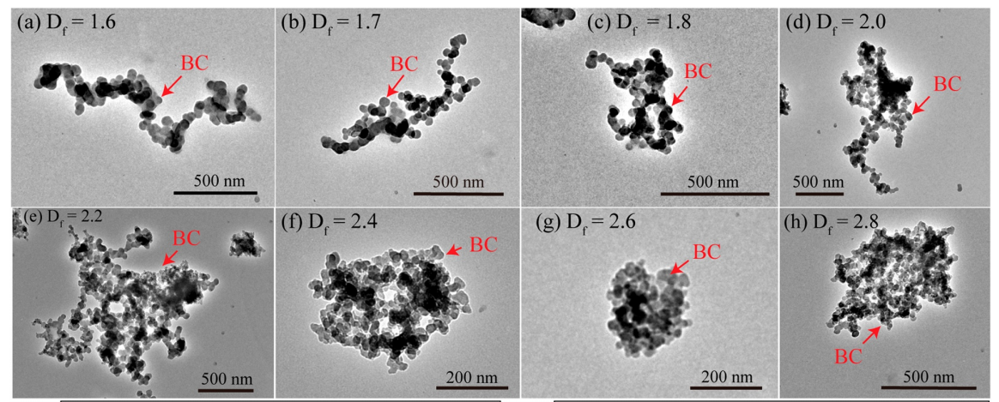
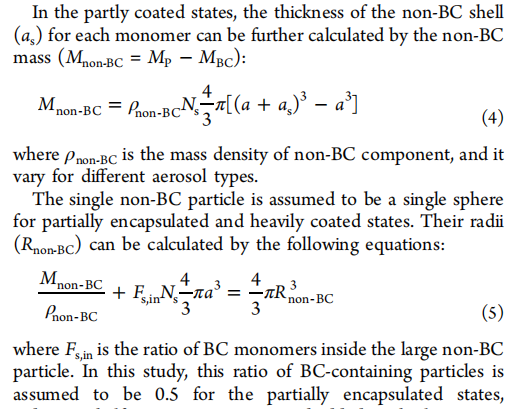
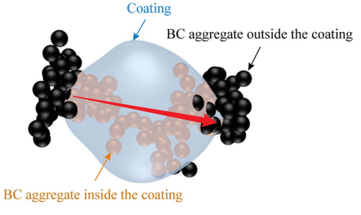

# 基本概念

## 测量仪器：差分电迁移率粒径分析仪（ＤＭＡ）

- Differential mobility analyzer 是利用不同粒径的带电粒子在电场中的受力大小不同而筛选出单粒径分布的颗粒物

- 串联差分电迁移率粒径分析-气溶胶质量分析系统（DMA-APM）

- 能够得到的数据：电迁移粒径mobility diameters ($D_{mob}$), 有效密度effective density ($\rho_{eff}$ ), 等效体积粒径volume-equivalent diameter ($D_{ve}$) 

  - 电迁移粒径指在相同条件下具有相同电迁移力的球形颗粒物的粒径，与有效密度对应，可通过公式计算：

    - $m = \rho_{eff} \times \pi/6 \times D_{mob}^3$

  - 对于非球形粒子，$D_{mob}$大于$D_{ev}$；对于球形粒子，两者相等

    

## 形状因子

- 分形结构（fractal aggregates）中的几个概念：

  - 分形维数$D_f$:
    - 球形时，m和$D_p$的3次方成正比，所以$D_f$=3
    - 非球形时，$D_f$<3，且越偏离球形，$D_f$越小
    - 极端情况，当成一条直线时，$D_f$=1
    - 计算公式，其中$R_g$是旋转半径
    - $N=k_g \times (2R_g/d_p)^{D_f}$
    - 

  - 包裹物粒径，$D_p/D_c$比值：
    - 对于裸露的BC（bare BC particles）： $D_p/D_c=1$
    - 对于全包裹的BC（embedded BC particles）：$D_p/D_c$等于包裹物和BC聚集体（BC aggregate）的体积比
    - 对于部分包裹的BC（partly coated BC particles）：$D_p/D_c$ 不能简单得到，如图中红线所示是整个粒子的粒径（$D_p$）
    - $D_p/D_c = [(V_{coating}+V_{BC}-V_{BCinside})/V_{BC}]^{1/3}$ (Wang et al., 2021, JGR)
    - 被包裹住的部分的总质量=粒子总质量-裸露在外的BC质量? (Wu et al., 2018, EST, Light Absorption Enhancement of Black Carbon Aerosol Constrained by Particle Morphology )
    - 
    - 
  - 形状因子$\chi$
    - 定义为在空气中运动的不规则颗粒物所受到的阻力与同等条件下等体积的球形颗粒物所受到的阻力的比值，
    - 阻力$F_{drag}(D)=3 \pi \eta vD/C(D)$；C(D)是滑动校准系数，有公式
    - 形状因子 $\chi = F_{drag}(D_p)/F_{drag}(D_{ev})=D_pC(D_{ev})/D_{ev}C(D_p)$
    - 当颗粒物为规则的球形，二者阻力相等，即形状因子为１，而不规则颗粒物所受到的阻力$F_{drag}(D_p)$会大于对应的球形颗粒物所受到的阻力$F_{drag}(D_{ev})$，即形状因子大于１，并且该值越大，表示越偏离球形

